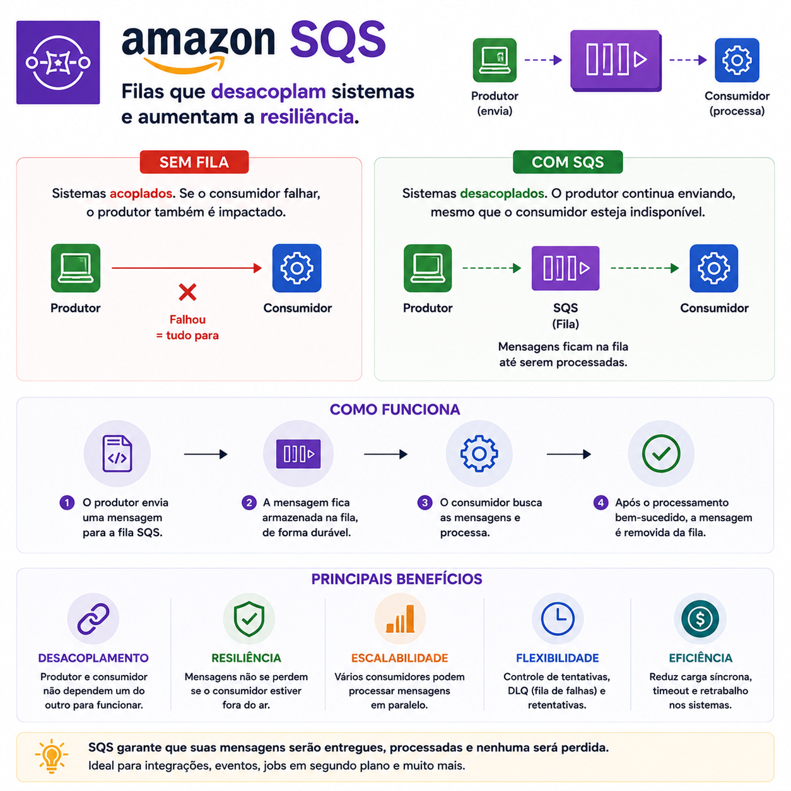

# Amazon SQS: desacoplando sistemas e aumentando a resiliência

> 🟡 **Intermediário** • ⏱️ **7 min de leitura**
>
> **Tecnologias:** AWS • Amazon SQS • Microsserviços • Backend



!!! info "Neste artigo você verá"

    Ao final deste artigo você será capaz de:

    - Entender o papel do Amazon SQS em arquiteturas distribuídas.
    - Descobrir por que filas aumentam a resiliência dos sistemas.
    - Conhecer os principais casos de uso do SQS.
    - Entender quando utilizar processamento assíncrono.

---

## O problema

Imagine uma aplicação que, após concluir uma compra, precise executar diversas tarefas:

- enviar um e-mail;
- emitir uma nota fiscal;
- atualizar o estoque;
- notificar outros sistemas.

Se tudo isso acontecer de forma síncrona, qualquer falha em um desses serviços poderá atrasar ou até impedir a conclusão da compra.

Quanto mais dependências existirem, maior será o risco de indisponibilidade.

---

## Por que isso importa?

Em sistemas distribuídos, falhas são inevitáveis.

Serviços podem ficar indisponíveis, responder lentamente ou sofrer picos de carga.

Quando as aplicações dependem diretamente umas das outras, uma falha localizada pode afetar todo o fluxo de negócio.

Filas existem justamente para reduzir esse acoplamento.

---

## O que é o Amazon SQS?

O Amazon Simple Queue Service (SQS) é um serviço de filas totalmente gerenciado da AWS.

Seu objetivo é armazenar mensagens temporariamente até que algum consumidor esteja disponível para processá-las.

Em vez de comunicar dois serviços diretamente, o produtor envia uma mensagem para a fila.

O consumidor a processa quando estiver pronto.

---

## Como funciona?

Um fluxo simplificado pode ser representado assim:

```text
Aplicação
      │
      ▼
Amazon SQS
      │
      ▼
Worker
      │
      ▼
Envio de e-mail
```

Caso o serviço de e-mail esteja indisponível naquele momento, a mensagem permanece armazenada na fila até que possa ser processada.

A compra continua sendo concluída normalmente.

---

## Principais benefícios

Utilizar filas oferece diversas vantagens:

- desacoplamento entre serviços;
- maior tolerância a falhas;
- processamento assíncrono;
- absorção de picos de demanda;
- escalabilidade com múltiplos consumidores;
- redução do impacto causado por indisponibilidade temporária.

Esses benefícios fazem do SQS uma peça importante em arquiteturas modernas.

---

## Casos de uso

O Amazon SQS é bastante utilizado para:

- envio de e-mails;
- processamento de pagamentos;
- geração de relatórios;
- processamento de imagens;
- integrações entre sistemas;
- notificações;
- workflows assíncronos.

Sempre que uma operação não precisa ser concluída imediatamente, uma fila pode ser uma boa alternativa.

---

## Standard Queue × FIFO Queue

O SQS oferece dois tipos principais de fila.

### Standard Queue

- alta escalabilidade;
- maior throughput;
- entrega **pelo menos uma vez** (*at-least-once*);
- ordem das mensagens não é garantida.

É a opção mais utilizada na maioria dos cenários.

---

### FIFO Queue

- preserva a ordem das mensagens;
- evita processamento duplicado dentro da janela de deduplicação;
- menor throughput em comparação à Standard Queue.

É indicada quando a ordem de processamento é um requisito importante.

---

## Quando utilizar

O SQS costuma ser uma excelente escolha quando:

- as operações podem ser assíncronas;
- existe comunicação entre microsserviços;
- é necessário absorver picos de carga;
- diferentes consumidores processam tarefas independentes;
- há necessidade de reduzir o acoplamento entre aplicações.

---

## Quando evitar

Nem todo fluxo precisa de uma fila.

Se o usuário depende da resposta imediatamente, adicionar uma etapa assíncrona pode aumentar a complexidade sem trazer benefícios.

Também é importante lembrar que consumidores de filas devem ser preparados para processar mensagens duplicadas, especialmente ao utilizar Standard Queues.

---

## Boas práticas

Algumas recomendações ajudam bastante:

- projetar consumidores idempotentes;
- utilizar Dead Letter Queues (DLQ);
- configurar tempos adequados de Visibility Timeout;
- monitorar o tamanho das filas;
- definir políticas de retry para falhas temporárias.

Esses cuidados aumentam a confiabilidade do processamento.

---

## Na prática

Imagine uma plataforma de e-commerce que recebe milhares de pedidos durante uma campanha promocional.

Cada compra precisa enviar um e-mail de confirmação.

Sem uma fila, uma indisponibilidade temporária no serviço de e-mail poderia afetar diretamente o processo de compra.

Com o Amazon SQS, os pedidos continuam sendo registrados normalmente.

As mensagens ficam armazenadas na fila e são processadas pelos consumidores assim que o serviço volta a responder.

O usuário conclui a compra sem perceber a indisponibilidade de um componente secundário.

---

## Conclusão

O Amazon SQS não torna uma aplicação mais rápida.

Ele torna a arquitetura mais resiliente.

Ao desacoplar serviços e permitir processamento assíncrono, filas reduzem o impacto de falhas temporárias, facilitam a escalabilidade e aumentam a confiabilidade das aplicações.

Por isso, o SQS é amplamente utilizado em integrações, processamento de pagamentos, envio de notificações e arquiteturas orientadas a eventos.

---

## Continue aprendendo

Se este assunto foi útil para você, recomendo também:

- Event-Driven Architecture
- Redis: muito além do cache
- Circuit Breaker + Retry
- Idempotência

---

## Referências

- Amazon SQS Developer Guide
- AWS Well-Architected Framework
- Designing Data-Intensive Applications — Martin Kleppmann
- Enterprise Integration Patterns — Gregor Hohpe e Bobby Woolf