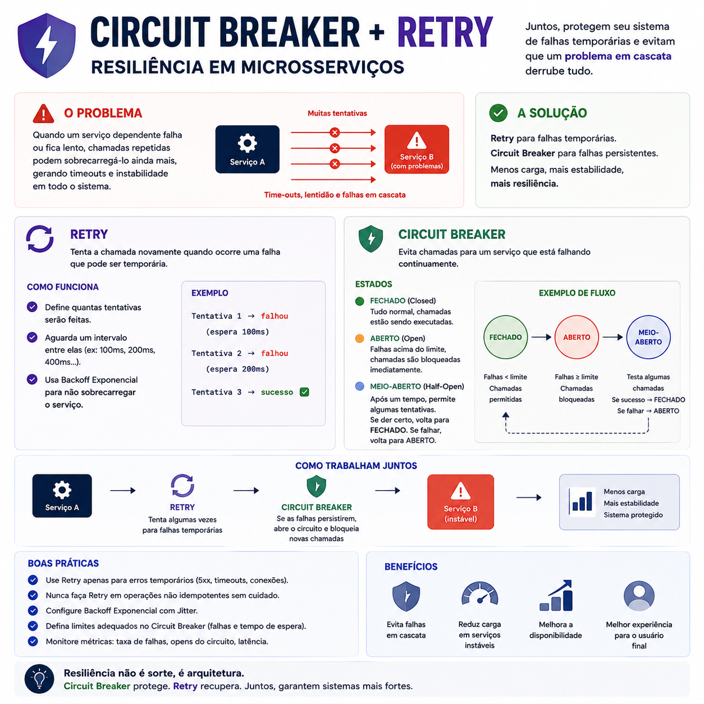

# Circuit Breaker + Retry: construindo sistemas mais resilientes

> 🟡 **Intermediário** • ⏱️ **7 min de leitura**
>
> **Tecnologias:** Microsserviços • Arquitetura de Software • Resiliência



!!! info "Neste artigo você verá"

    Ao final deste artigo você será capaz de:

    - Entender a diferença entre Retry e Circuit Breaker.
    - Saber quando utilizar cada padrão.
    - Compreender como eles trabalham em conjunto.
    - Evitar falhas em cascata em sistemas distribuídos.

---

## O problema

Em arquiteturas de microsserviços, é comum que uma aplicação dependa de diversos serviços externos.

Uma requisição pode envolver APIs, bancos de dados, filas, serviços de autenticação e integrações com terceiros.

Mas o que acontece quando um desses componentes começa a falhar?

Se nada for feito, as falhas podem se propagar rapidamente, aumentando a latência, consumindo recursos desnecessários e comprometendo todo o sistema.

---

## Por que isso importa?

Nem toda falha tem a mesma causa.

Algumas são temporárias, como um timeout ou uma instabilidade momentânea na rede.

Outras persistem por minutos ou até horas, tornando qualquer nova tentativa apenas um desperdício de recursos.

Por isso, diferentes estratégias são necessárias para lidar com diferentes tipos de falha.

---

## Retry

O padrão **Retry** consiste em repetir automaticamente uma operação quando há indícios de que a falha é temporária.

É muito útil em situações como:

- timeout de rede;
- indisponibilidade momentânea;
- falhas transitórias em APIs;
- perda temporária de conexão.

Em vez de falhar imediatamente, a aplicação realiza uma ou mais novas tentativas antes de retornar um erro.

### Exemplo

```text
Requisição
    │
    ▼
Falhou
    │
    ▼
Retry
    │
    ▼
Sucesso
```

Quando configurado corretamente, o Retry aumenta significativamente a taxa de sucesso em integrações.

---

## Circuit Breaker

O **Circuit Breaker** possui um objetivo diferente.

Em vez de insistir em chamadas para um serviço que continua indisponível, ele interrompe temporariamente novas requisições.

Seu funcionamento costuma seguir três estados:

### Closed

O serviço está saudável.

Todas as requisições são executadas normalmente.

---

### Open

Após sucessivas falhas, o circuito é aberto.

Novas chamadas deixam de ser realizadas, evitando sobrecarga.

---

### Half-Open

Após um intervalo configurado, algumas requisições são permitidas.

Se elas forem bem-sucedidas, o circuito volta ao estado **Closed**.

Caso contrário, retorna ao estado **Open**.

---

## Como eles trabalham juntos?

Esses padrões não competem entre si.

Na prática, eles costumam ser utilizados em conjunto.

Um fluxo simplificado pode ser representado assim:

```text
Requisição
      │
      ▼
Retry (algumas tentativas)
      │
      ├── Sucesso → Continua
      │
      ▼
Falhou novamente
      │
      ▼
Circuit Breaker
      │
      ▼
Interrompe novas chamadas
```

Enquanto o Retry tenta recuperar falhas temporárias, o Circuit Breaker protege o restante do sistema quando o problema persiste.

---

## Benefícios

Utilizar essas estratégias traz diversas vantagens:

- maior disponibilidade;
- redução de falhas em cascata;
- melhor experiência para o usuário;
- menor consumo de recursos;
- recuperação mais rápida após incidentes;
- sistemas mais resilientes.

---

## Quando utilizar

Esses padrões fazem bastante sentido quando existem:

- chamadas entre microsserviços;
- integrações com APIs externas;
- acesso a bancos de dados remotos;
- comunicação assíncrona;
- operações sujeitas a falhas transitórias.

Quanto maior a dependência entre serviços, maior tende a ser o benefício dessas estratégias.

---

## Quando evitar

Nem toda operação deve ser repetida automaticamente.

Retries indiscriminados podem gerar efeitos colaterais, especialmente em operações que alteram estado.

Nesses casos, é importante que a operação seja idempotente ou que existam mecanismos para evitar processamento duplicado.

Da mesma forma, um Circuit Breaker mal configurado pode impedir chamadas para um serviço que já voltou ao normal.

---

## Boas práticas

Algumas recomendações ajudam a utilizar esses padrões de forma eficiente:

- limitar o número de tentativas;
- utilizar backoff exponencial entre retries;
- monitorar a taxa de falhas;
- definir tempos adequados para reabertura do circuito;
- combinar essas estratégias com observabilidade;
- projetar operações idempotentes sempre que possível.

---

## Na prática

Imagine um serviço responsável por processar pagamentos.

Durante alguns segundos, a API da operadora apresenta instabilidade.

O Retry realiza novas tentativas e a operação é concluída com sucesso.

Agora imagine um cenário em que essa API permanece indisponível por vários minutos.

Continuar enviando requisições apenas aumentaria a fila de espera e consumiria recursos desnecessários.

Nesse momento, o Circuit Breaker interrompe temporariamente as chamadas, protegendo a aplicação e permitindo que o serviço seja restabelecido antes de novas tentativas.

---

## Conclusão

Retry e Circuit Breaker possuem objetivos diferentes, mas se complementam perfeitamente.

Enquanto o Retry busca recuperar falhas temporárias, o Circuit Breaker protege o sistema contra falhas persistentes e evita o efeito cascata.

Projetar aplicações resilientes significa assumir que falhas irão acontecer e preparar o sistema para lidar com elas de forma previsível.

No fim, resiliência não acontece por acaso.

Ela é resultado de boas decisões de arquitetura.

---

## Continue aprendendo

Se este assunto foi útil para você, recomendo também:

- Event-Driven Architecture
- Amazon SQS
- Observabilidade
- Idempotência

---

## Referências

- Release It! — Michael T. Nygard
- Building Microservices — Sam Newman
- Microsoft Azure Architecture Center — Circuit Breaker Pattern
- Martin Fowler — Circuit Breaker