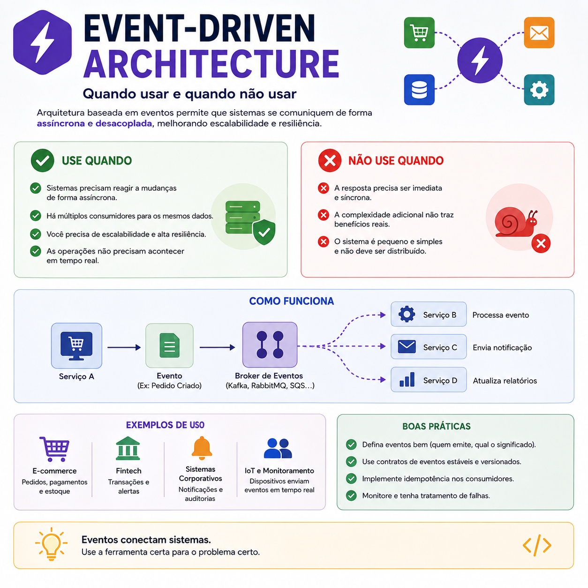

# Event-Driven Architecture: quando usar e quando evitar

> 🟡 **Intermediário** • ⏱️ **8 min de leitura**
>
> **Tecnologias:** Arquitetura de Software • Microsserviços • Mensageria



!!! info "Neste artigo você verá"

    Ao final deste artigo você será capaz de:

    - Entender o que é Event-Driven Architecture.
    - Identificar quando esse modelo faz sentido.
    - Reconhecer cenários onde ele aumenta a complexidade sem necessidade.
    - Conhecer boas práticas para aplicações orientadas a eventos.

---

## O problema

Arquitetura Orientada a Eventos (Event-Driven Architecture ou EDA) se tornou um dos modelos mais utilizados em sistemas distribuídos.

Depois de conhecer seus benefícios, é comum surgir a ideia de utilizá-la em qualquer projeto.

Mas essa nem sempre é a melhor decisão.

Como qualquer padrão arquitetural, ela resolve problemas específicos e também introduz novas responsabilidades.

---

## Por que isso importa?

Toda decisão arquitetural envolve trade-offs.

Enquanto a EDA aumenta desacoplamento e escalabilidade, ela também adiciona desafios relacionados à consistência, observabilidade, monitoramento e depuração.

Por isso, a pergunta correta não é:

**"Posso usar eventos?"**

Mas sim:

**"Meu problema realmente precisa dessa arquitetura?"**

---

## O que é Event-Driven Architecture?

Nesse modelo, aplicações se comunicam por meio de eventos.

Em vez de um serviço chamar outro diretamente, ele publica um evento informando que algo aconteceu.

Os demais serviços interessados recebem esse evento e executam suas próprias ações.

Um fluxo simples pode ser representado assim:

```text
Pedido criado
      │
      ▼
 Evento publicado
      │
      ▼
 ┌─────────────┬──────────────┬──────────────┐
 ▼             ▼              ▼
Estoque     Financeiro     Notificações
```

Cada serviço trabalha de forma independente, sem conhecer a implementação dos demais.

---

## Quando utilizar

Arquitetura Orientada a Eventos costuma ser uma excelente escolha quando:

- vários serviços precisam reagir ao mesmo evento;
- as operações podem acontecer de forma assíncrona;
- o desacoplamento entre serviços é importante;
- existe necessidade de alta escalabilidade;
- a aplicação precisa continuar funcionando mesmo quando parte do sistema está indisponível.

Esses cenários aparecem com frequência em microsserviços e plataformas distribuídas.

---

## Quando evitar

Nem toda aplicação precisa desse nível de complexidade.

Em muitos casos, uma chamada síncrona continua sendo a melhor solução.

Evite utilizar EDA quando:

- a resposta precisa ser imediata;
- existe dependência direta entre as operações;
- o sistema é pequeno;
- há poucos serviços envolvidos;
- a complexidade será maior que o benefício.

Uma arquitetura simples costuma ser mais fácil de desenvolver, testar e manter.

---

## Principais benefícios

Quando aplicada ao problema correto, a EDA oferece vantagens importantes:

- baixo acoplamento entre serviços;
- escalabilidade independente;
- maior resiliência;
- processamento assíncrono;
- facilidade para integrar novos consumidores.

Novos serviços podem começar a consumir eventos existentes sem necessidade de alterar quem os publica.

---

## Desafios

Apesar das vantagens, também existem desafios importantes:

- consistência eventual;
- maior dificuldade de depuração;
- necessidade de observabilidade;
- tratamento de mensagens duplicadas;
- idempotência;
- monitoramento das filas e brokers.

Esses aspectos fazem parte da complexidade natural de sistemas distribuídos.

---

## Boas práticas

Algumas recomendações ajudam bastante:

- publicar eventos representando fatos de negócio;
- manter eventos pequenos e objetivos;
- tornar consumidores idempotentes;
- monitorar filas e consumidores;
- utilizar Dead Letter Queues (DLQ) para mensagens com falha;
- investir em logs, métricas e traces.

Essas práticas aumentam a confiabilidade e facilitam a operação da plataforma.

---

## Na prática

Imagine uma plataforma de e-commerce.

Quando um pedido é confirmado, um único evento **PedidoCriado** pode ser publicado.

A partir dele:

- o estoque realiza a reserva dos produtos;
- o financeiro inicia o faturamento;
- o serviço de notificações envia um e-mail ao cliente;
- o sistema de analytics atualiza seus indicadores.

Nenhum desses serviços precisa conhecer diretamente os demais.

Todos apenas reagem ao mesmo evento.

Esse desacoplamento facilita a evolução da plataforma e permite adicionar novos consumidores sem alterar o serviço responsável pela criação do pedido.

---

## Conclusão

Event-Driven Architecture é uma ferramenta extremamente poderosa, mas não deve ser aplicada indiscriminadamente.

Ela resolve muito bem problemas relacionados a desacoplamento, escalabilidade e processamento assíncrono, porém introduz desafios próprios dos sistemas distribuídos.

A melhor arquitetura não é a mais moderna nem a mais sofisticada.

É aquela que resolve o problema com o menor nível de complexidade necessário.

---

## Continue aprendendo

Se este assunto foi útil para você, recomendo também:

- Amazon SQS
- Redis: muito além do cache
- Circuit Breaker + Retry
- Idempotência

---

## Referências

- Designing Data-Intensive Applications — Martin Kleppmann
- Building Microservices — Sam Newman
- Enterprise Integration Patterns — Gregor Hohpe e Bobby Woolf
- Martin Fowler — Event-Driven Architecture