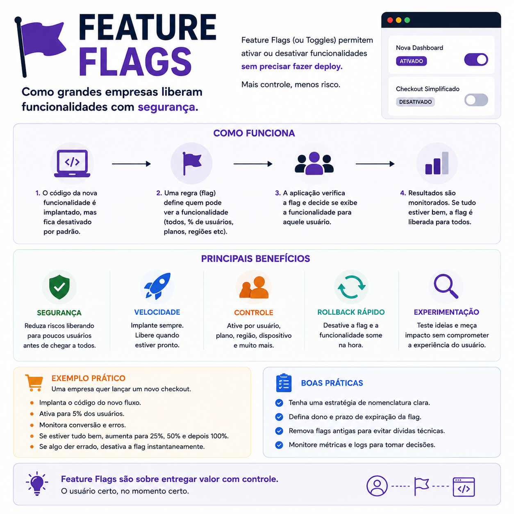

# Feature Flags: liberando funcionalidades com mais segurança

> 🟡 **Intermediário** • ⏱️ **7 min de leitura**
>
> **Tecnologias:** Arquitetura de Software • DevOps • Continuous Delivery



!!! info "Neste artigo você verá"

    Ao final deste artigo você será capaz de:

    - Entender o que são Feature Flags.
    - Descobrir como elas reduzem riscos em produção.
    - Conhecer cenários reais de utilização.
    - Aprender boas práticas para gerenciar Feature Flags.

---

## O problema

Tradicionalmente, publicar uma nova funcionalidade significava disponibilizá-la imediatamente para todos os usuários.

Se algum problema fosse identificado, muitas vezes a única alternativa era realizar um novo deploy ou até mesmo um rollback completo da aplicação.

Esse modelo funciona em sistemas pequenos, mas se torna cada vez mais arriscado à medida que o produto cresce.

---

## Por que isso importa?

Nem toda funcionalidade está pronta para ser utilizada por toda a base de usuários.

Em muitos casos, é interessante validar o comportamento da aplicação, acompanhar métricas ou realizar testes com um grupo reduzido antes da liberação completa.

Feature Flags permitem fazer isso sem a necessidade de novos deploys.

O código já está em produção, mas a funcionalidade permanece desativada até que a equipe decida habilitá-la.

---

## O que são Feature Flags?

Feature Flags (ou Feature Toggles) são mecanismos que permitem controlar o comportamento da aplicação por meio de configurações.

Em vez de decidir durante o deploy quais funcionalidades estarão disponíveis, essa decisão passa a ser feita em tempo de execução.

Um exemplo simples:

```python
if feature_flags.is_enabled("novo_checkout"):
    exibir_novo_checkout()
else:
    exibir_checkout_antigo()
```

A aplicação continua sendo a mesma.

O que muda é o comportamento definido pela flag.

---

## Como elas funcionam?

Um fluxo bastante comum é:

```text
Deploy da funcionalidade
            │
            ▼
Feature Flag desativada
            │
            ▼
Apenas usuários selecionados
recebem a nova funcionalidade
            │
            ▼
Monitoramento de métricas
            │
            ▼
Liberação gradual
            │
            ▼
Todos os usuários
```

Essa estratégia reduz significativamente o risco associado a grandes mudanças.

---

## Principais benefícios

Feature Flags oferecem diversas vantagens:

- liberação gradual de funcionalidades;
- testes A/B;
- validação de hipóteses com usuários reais;
- rollback funcional sem novo deploy;
- redução de riscos em grandes releases;
- maior controle sobre a evolução do produto.

Elas permitem separar o momento do deploy do momento da disponibilização da funcionalidade.

---

## Quando utilizar

Feature Flags são especialmente úteis para:

- grandes funcionalidades;
- mudanças arquiteturais;
- testes A/B;
- rollout gradual;
- funcionalidades em beta;
- experimentos de produto.

Quanto maior o impacto potencial da mudança, maior costuma ser o benefício dessa abordagem.

---

## Quando evitar

Nem toda alteração precisa de uma Feature Flag.

Criar flags para pequenas correções ou mudanças permanentes pode aumentar a complexidade da aplicação.

Outro erro comum é manter flags antigas por tempo indefinido.

Após a liberação completa da funcionalidade, elas devem ser removidas para evitar código desnecessário e reduzir a dívida técnica.

---

## Boas práticas

Algumas recomendações ajudam a manter esse mecanismo saudável:

- utilizar nomes claros para as flags;
- definir um responsável por cada flag;
- remover flags que não são mais necessárias;
- monitorar métricas durante o rollout;
- combinar Feature Flags com observabilidade;
- evitar múltiplas flags controlando o mesmo fluxo.

Feature Flags devem ser vistas como um mecanismo temporário de controle, não como uma camada permanente da aplicação.

---

## Na prática

Imagine que um novo fluxo de pagamento foi desenvolvido para uma plataforma com milhares de usuários.

Em vez de disponibilizá-lo imediatamente para toda a base, a equipe ativa a Feature Flag para apenas **5% dos usuários**.

Após alguns dias, as métricas mostram estabilidade, nenhuma regressão relevante e uma melhora na conversão.

A liberação é então ampliada para **25%**, depois **50%** e, por fim, **100%** dos usuários.

Caso algum problema fosse identificado durante esse processo, bastaria desativar a flag, sem realizar um novo deploy ou interromper o funcionamento da aplicação.

---

## Conclusão

Feature Flags mudam a forma como funcionalidades chegam aos usuários.

Em vez de associar cada deploy a uma liberação imediata, elas permitem controlar quando, para quem e em que ritmo uma novidade será disponibilizada.

Esse nível de controle reduz riscos, facilita experimentos e torna o processo de entrega muito mais seguro.

Não por acaso, Feature Flags fazem parte da estratégia de entrega contínua adotada por muitas empresas que operam sistemas de grande escala.

---

## Continue aprendendo

Se este assunto foi útil para você, recomendo também:

- Deu ruim em produção. E agora?
- Circuit Breaker + Retry
- Observabilidade
- Event-Driven Architecture

---

## Referências

- Martin Fowler — Feature Toggles
- LaunchDarkly Documentation
- Unleash Documentation
- Continuous Delivery — Jez Humble e David Farley