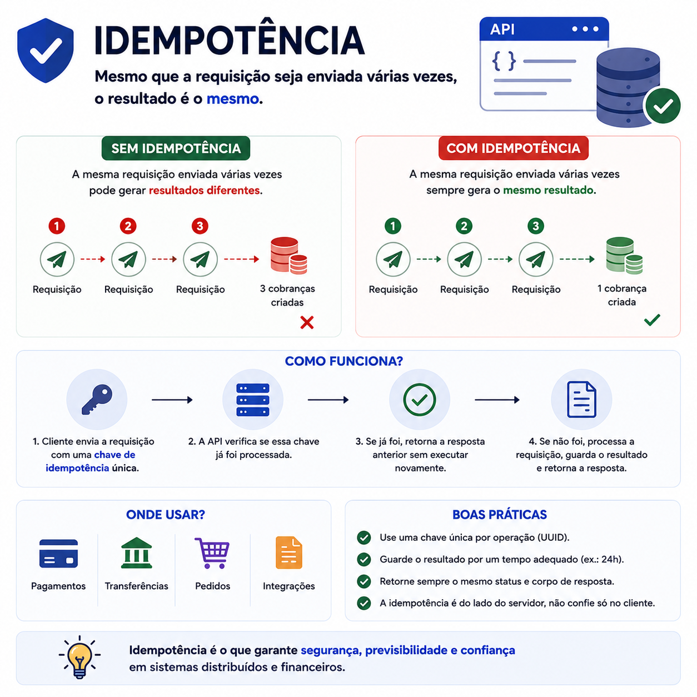

# Idempotência: por que uma mesma operação não deve acontecer duas vezes

> 🟡 **Intermediário** • ⏱️ **7 min de leitura**
>
> **Tecnologias:** APIs • Backend • Arquitetura de Software



!!! info "Neste artigo você verá"

    Ao final deste artigo você será capaz de:

    - Entender o conceito de idempotência.
    - Descobrir por que ela é indispensável em sistemas financeiros.
    - Conhecer estratégias para implementar operações idempotentes.
    - Evitar problemas causados por requisições duplicadas.

---

## O problema

Imagine que um usuário clique duas vezes no botão **"Pagar"**.

Ou que a conexão com a internet falhe logo após o envio da requisição.

Sem saber se a operação foi concluída, a aplicação decide reenviá-la.

Agora imagine que ambas as requisições sejam processadas.

O resultado pode ser:

- duas cobranças;
- dois pedidos;
- duas reservas;
- dados inconsistentes.

Em sistemas críticos, esse tipo de problema pode gerar prejuízo financeiro e comprometer a confiança dos usuários.

---

## Por que isso importa?

Falhas de rede, timeouts, retries automáticos e ações repetidas pelo usuário fazem parte do funcionamento normal de sistemas distribuídos.

Por isso, aplicações precisam ser preparadas para receber a mesma requisição mais de uma vez.

Idempotência existe justamente para garantir que uma operação produza sempre o mesmo resultado, independentemente da quantidade de tentativas.

---

## O que é idempotência?

Uma operação é considerada **idempotente** quando pode ser executada várias vezes sem alterar o resultado após a primeira execução.

Em outras palavras:

```text
1ª requisição → operação executada

2ª requisição → mesmo resultado

3ª requisição → mesmo resultado
```

A aplicação reconhece que aquela solicitação já foi processada anteriormente e evita executar novamente a mesma ação.

---

## Onde ela é importante?

Idempotência é fundamental em operações como:

- processamento de pagamentos;
- criação de pedidos;
- emissão de boletos;
- transferências bancárias;
- envio de notificações;
- processamento de mensagens em filas.

Sempre que executar a mesma operação duas vezes gerar um efeito indesejado, vale considerar uma estratégia de idempotência.

---

## Como implementar?

Existem diversas estratégias.

Uma das mais comuns é utilizar uma **Idempotency Key**.

O cliente envia um identificador único junto com a requisição.

Exemplo:

```http
POST /payments

Idempotency-Key:
5b1c4c91-91d4-4a1d-82fa-3cb4d4f7d5f1
```

Quando uma nova requisição chega com a mesma chave, a aplicação identifica que aquela operação já foi processada e devolve a resposta anterior, sem executar novamente a lógica de negócio.

Outra abordagem bastante utilizada consiste em verificar se a operação já existe antes de criá-la, utilizando identificadores únicos ou regras de negócio.

---

## Benefícios

Aplicações idempotentes oferecem diversas vantagens:

- evitam cobranças duplicadas;
- reduzem inconsistências de dados;
- permitem retries com segurança;
- aumentam a confiabilidade das APIs;
- simplificam integrações entre sistemas.

Esse conceito é especialmente importante em ambientes distribuídos.

---

## Idempotência × Retry

Esses conceitos costumam aparecer juntos, mas possuem papéis diferentes.

| Retry | Idempotência |
|--------|--------------|
| Repete uma operação após uma falha | Garante que repetir a operação não gere efeitos duplicados |
| Aumenta a chance de sucesso | Garante consistência dos dados |
| Atua no cliente ou consumidor | Atua na lógica da aplicação |

Em muitos sistemas, ambos trabalham em conjunto.

O Retry tenta novamente.

A idempotência garante que essa nova tentativa seja segura.

---

## Boas práticas

Algumas recomendações ajudam bastante:

- utilizar identificadores únicos para operações críticas;
- armazenar o resultado de requisições idempotentes;
- tornar consumidores de filas idempotentes;
- combinar idempotência com retries;
- monitorar operações duplicadas.

Esses cuidados aumentam significativamente a confiabilidade da aplicação.

---

## Na prática

Imagine uma API responsável por processar pagamentos.

Após enviar a requisição, o cliente perde a conexão e não recebe a resposta.

Sem saber se o pagamento foi concluído, ele tenta novamente.

Como ambas as chamadas utilizam a mesma **Idempotency Key**, a API identifica que a operação já foi processada e retorna exatamente o mesmo resultado da primeira requisição.

Nenhuma nova cobrança é criada.

Esse comportamento permite que clientes repitam requisições com segurança, mesmo diante de falhas de comunicação.

---

## Conclusão

Idempotência é um dos conceitos mais importantes para quem desenvolve APIs e sistemas distribuídos.

Ela garante que falhas de rede, retries automáticos ou ações repetidas do usuário não provoquem efeitos duplicados na aplicação.

Em sistemas financeiros, esse cuidado deixa de ser apenas uma boa prática.

Ele passa a ser um requisito essencial para garantir segurança, consistência e confiança.

---

## Continue aprendendo

Se este assunto foi útil para você, recomendo também:

- Amazon SQS
- Circuit Breaker + Retry
- Event-Driven Architecture
- Redis: muito além do cache

---

## Referências

- RFC 9110 — HTTP Semantics
- Stripe API Documentation — Idempotent Requests
- Designing Data-Intensive Applications — Martin Kleppmann
- Enterprise Integration Patterns — Gregor Hohpe e Bobby Woolf