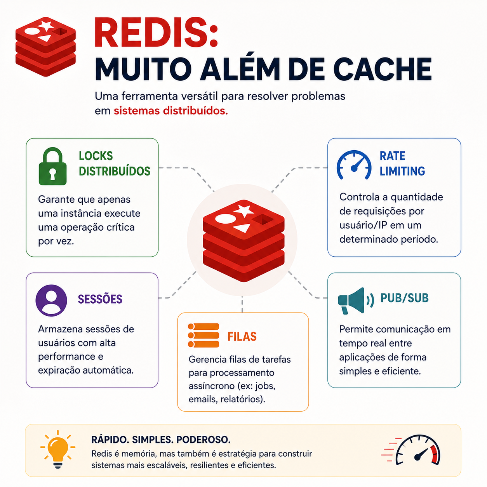

# Redis: muito além do cache

> 🟡 **Intermediário** • ⏱️ **8 min de leitura**
>
> **Tecnologias:** Redis • Backend • Arquitetura de Software



!!! info "Neste artigo você verá"

    Ao final deste artigo você será capaz de:

    - Entender por que o Redis vai muito além do cache.
    - Conhecer os principais casos de uso em sistemas distribuídos.
    - Descobrir quando utilizar cada recurso.
    - Aprender boas práticas para aproveitar melhor o Redis.

---

## O problema

Quando alguém fala em Redis, a primeira associação costuma ser cache.

Embora esse seja um dos seus usos mais conhecidos, limitar o Redis apenas a isso significa deixar de aproveitar boa parte do seu potencial.

Graças à sua velocidade e às estruturas de dados que oferece, o Redis resolve diversos problemas comuns em aplicações modernas.

---

## Por que isso importa?

Sistemas distribuídos normalmente precisam lidar com desafios como:

- evitar processamento duplicado;
- limitar excesso de requisições;
- compartilhar sessões entre múltiplas instâncias;
- processar tarefas assíncronas;
- trocar mensagens entre serviços.

Resolver cada um desses problemas utilizando ferramentas diferentes aumenta a complexidade da arquitetura.

Em muitos cenários, o Redis consegue atender a várias dessas necessidades de forma simples e eficiente.

---

## Cache

O caso de uso mais conhecido.

Em vez de consultar repetidamente um banco de dados ou uma API, informações frequentemente acessadas são armazenadas em memória.

```text
Aplicação
     │
     ▼
Redis
(Cache Hit)
     │
     ▼
Resposta imediata
```

Isso reduz latência, diminui carga sobre outros serviços e melhora a experiência do usuário.

---

## Locks distribuídos

Quando várias instâncias da aplicação executam simultaneamente, pode ser necessário garantir que apenas uma realize determinada operação.

O Redis pode atuar como um mecanismo de lock distribuído.

Exemplos:

- processamento de pagamentos;
- geração de boletos;
- envio de e-mails;
- execução de tarefas agendadas.

Esse mecanismo evita processamento duplicado e reduz problemas de concorrência.

---

## Rate Limiting

Outro uso bastante comum é limitar a quantidade de requisições realizadas por um cliente em determinado intervalo.

Exemplos:

- APIs públicas;
- autenticação;
- prevenção de abuso;
- proteção contra ataques automatizados.

Como o Redis trabalha inteiramente em memória, esse controle pode ser realizado com baixa latência.

---

## Sessões

Em aplicações distribuídas, diferentes requisições do mesmo usuário podem ser atendidas por servidores distintos.

Armazenar sessões no Redis permite que qualquer instância da aplicação recupere rapidamente essas informações.

Isso facilita a escalabilidade horizontal sem depender de memória local.

---

## Filas

O Redis também pode ser utilizado para processamento assíncrono.

Bibliotecas como RQ e Celery utilizam Redis como broker para distribuir tarefas entre diferentes workers.

Alguns exemplos:

- envio de e-mails;
- geração de relatórios;
- processamento de imagens;
- importação de dados.

Esse modelo reduz o tempo de resposta das aplicações e melhora a experiência do usuário.

---

## Pub/Sub

Outro recurso bastante utilizado é o mecanismo de publicação e assinatura de mensagens.

Nesse modelo:

- um serviço publica uma mensagem;
- múltiplos consumidores recebem o evento em tempo real.

Esse padrão é útil para:

- notificações;
- comunicação entre serviços;
- atualizações em tempo real;
- eventos internos.

Embora não substitua plataformas como Kafka ou RabbitMQ em todos os cenários, pode ser uma excelente solução para aplicações menores ou comunicações simples.

---

## Quando utilizar

O Redis costuma ser uma excelente escolha quando há necessidade de:

- cache de alta performance;
- compartilhamento de sessões;
- locks distribuídos;
- filas leves;
- rate limiting;
- comunicação Pub/Sub.

Sua velocidade faz dele uma ferramenta extremamente versátil.

---

## Quando evitar

Apesar de poderoso, o Redis não substitui um banco de dados relacional nem uma plataforma completa de mensageria.

Também não deve ser utilizado para armazenar permanentemente informações críticas sem considerar persistência, backup e recuperação.

Cada tecnologia deve ser utilizada para o problema que foi projetada para resolver.

---

## Boas práticas

Algumas recomendações ajudam a utilizar Redis de forma eficiente:

- definir TTL para dados temporários;
- monitorar consumo de memória;
- evitar armazenar objetos muito grandes;
- escolher estruturas de dados adequadas;
- utilizar chaves padronizadas;
- revisar periodicamente informações expiradas.

Esses cuidados mantêm o ambiente organizado e evitam desperdício de recursos.

---

## Na prática

Imagine uma plataforma de e-commerce durante uma grande campanha promocional.

O Redis pode ser utilizado simultaneamente para:

- armazenar sessões dos usuários;
- limitar tentativas de login;
- manter produtos populares em cache;
- distribuir tarefas de envio de e-mails;
- impedir que o mesmo pedido seja processado duas vezes por meio de locks distribuídos.

Tudo isso utilizando uma única tecnologia especializada em operações rápidas na memória.

Esse é um dos motivos pelos quais o Redis está presente em tantas arquiteturas modernas.

---

## Conclusão

O Redis é muito mais do que uma solução de cache.

Sua velocidade e flexibilidade permitem resolver diversos desafios comuns em sistemas distribuídos, desde controle de concorrência até processamento assíncrono e comunicação entre serviços.

Conhecer esses diferentes casos de uso ajuda a escolher a ferramenta certa para cada problema e aproveitar melhor todo o potencial que o Redis oferece.

---

## Continue aprendendo

Se este assunto foi útil para você, recomendo também:

- Amazon SQS
- Event-Driven Architecture
- Circuit Breaker + Retry
- Idempotência

---

## Referências

- Redis Documentation
- Redis University
- Designing Data-Intensive Applications — Martin Kleppmann
- Redis in Action — Josiah L. Carlson