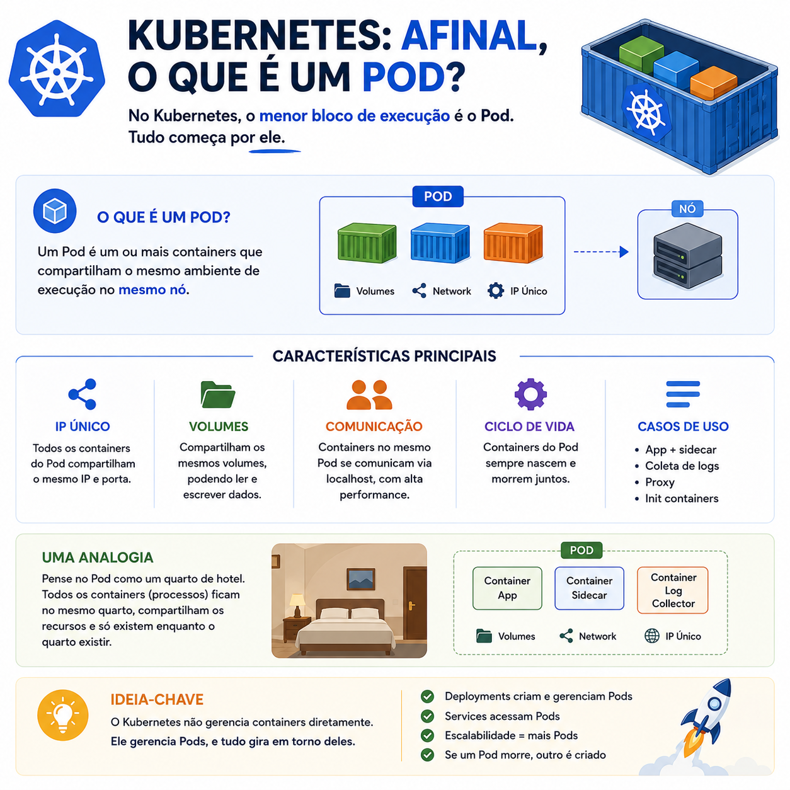

# Kubernetes: afinal, o que é um Pod?

> 🟡 **Intermediário** • ⏱️ **7 min de leitura**
>
> **Tecnologias:** Kubernetes • Containers • DevOps



!!! info "Neste artigo você verá"

    Ao final deste artigo você será capaz de:

    - Entender o que é um Pod.
    - Descobrir por que o Kubernetes gerencia Pods, e não containers.
    - Compreender quando um Pod possui um ou vários containers.
    - Construir uma base sólida para aprender os demais recursos do Kubernetes.

---

## O problema

Quando alguém começa a estudar Kubernetes, é muito comum ouvir a frase:

> "O Kubernetes gerencia containers."

Embora isso não esteja completamente errado, existe um detalhe importante.

Na prática, o Kubernetes não trabalha diretamente com containers.

Ele trabalha com **Pods**.

Entender essa diferença torna muito mais fácil compreender conceitos como Deployments, Services, escalabilidade e atualizações da aplicação.

---

## Por que isso importa?

Grande parte dos recursos do Kubernetes opera sobre Pods.

Quando um Deployment cria novas réplicas, ele cria Pods.

Quando um Service distribui tráfego, ele envia requisições para Pods.

Quando ocorre um autoscaling, novos Pods são criados.

Por isso, entender essa unidade básica facilita praticamente todo o restante da plataforma.

---

## O que é um Pod?

Um Pod é a menor unidade de execução do Kubernetes.

Ele representa um ambiente onde um ou mais containers são executados juntos.

Todos os containers de um mesmo Pod compartilham:

- endereço IP;
- porta de rede;
- volumes de armazenamento;
- namespace de rede.

Na maioria das aplicações existe apenas um container por Pod, mas isso não é uma regra.

---

## Um Pod pode ter vários containers?

Sim.

Embora o cenário mais comum seja um único container, existem situações em que múltiplos containers trabalham juntos no mesmo Pod.

Um exemplo clássico é o padrão **Sidecar**.

```text
Pod
│
├── Container da aplicação
│
└── Container de logs
```

Como ambos compartilham rede e armazenamento, conseguem colaborar de forma bastante eficiente.

---

## O ciclo de vida de um Pod

Pods não são permanentes.

Se um Pod falhar ou precisar ser substituído durante uma atualização, o Kubernetes cria outro Pod para assumir seu lugar.

É importante perceber que não existe "reinicialização" do mesmo Pod.

Na maioria das situações, um novo Pod é criado e o anterior é removido.

Por isso, aplicações devem ser preparadas para esse comportamento.

---

## Como o Kubernetes utiliza Pods?

Um fluxo simplificado pode ser representado assim:

```text
Deployment
      │
      ▼
Cria Pods
      │
      ▼
Cada Pod executa
um ou mais containers
      │
      ▼
Service envia tráfego
para esses Pods
```

Esse modelo permite que a aplicação seja escalada de forma simples, apenas aumentando ou reduzindo a quantidade de Pods.

---

## Benefícios

Utilizar Pods como unidade de execução oferece diversas vantagens:

- isolamento entre aplicações;
- escalabilidade simples;
- substituição automática em caso de falhas;
- compartilhamento de recursos entre containers relacionados;
- integração com todos os recursos do Kubernetes.

Essa abstração facilita o gerenciamento de aplicações distribuídas.

---

## Quando utilizar múltiplos containers?

Na maior parte das aplicações, um único container por Pod é suficiente.

Mais de um container costuma fazer sentido quando existe uma forte relação entre eles.

Alguns exemplos:

- Sidecar para coleta de logs;
- proxies como Envoy;
- sincronização de arquivos;
- monitoramento.

Containers sem dependência direta normalmente devem ser executados em Pods diferentes.

---

## Boas práticas

Algumas recomendações ajudam bastante:

- manter um container principal por Pod sempre que possível;
- utilizar múltiplos containers apenas quando realmente compartilharem o mesmo ciclo de vida;
- evitar armazenar dados importantes localmente no Pod;
- tratar Pods como recursos descartáveis;
- monitorar consumo de CPU e memória.

Essas práticas tornam a aplicação mais alinhada com a filosofia do Kubernetes.

---

## Na prática

Imagine uma API executando em Kubernetes.

O Deployment está configurado para manter três réplicas.

Na prática, isso significa que existirão três Pods em execução.

Se um deles apresentar falha, o Kubernetes cria automaticamente outro Pod para manter a quantidade desejada.

A aplicação continua disponível sem intervenção manual.

Essa capacidade de recuperação automática é um dos principais motivos pelos quais Kubernetes se tornou tão popular em ambientes de produção.

---

## Conclusão

O Pod é a menor unidade de execução do Kubernetes e representa a base de praticamente todos os demais conceitos da plataforma.

Embora execute containers, é o Pod que o Kubernetes cria, monitora, substitui e escala.

Dominar esse conceito torna muito mais fácil compreender Deployments, Services, escalabilidade e os demais recursos do ecossistema Kubernetes.

---

## Continue aprendendo

Se este assunto foi útil para você, recomendo também:

- Kubernetes: Requests vs Limits
- Amazon SQS
- Observabilidade
- Circuit Breaker + Retry

---

## Referências

- Kubernetes Documentation — Pods
- Kubernetes Documentation — Workloads
- Kubernetes Documentation — Sidecar Containers
- Kubernetes Up & Running — Brendan Burns, Joe Beda e Kelsey Hightower