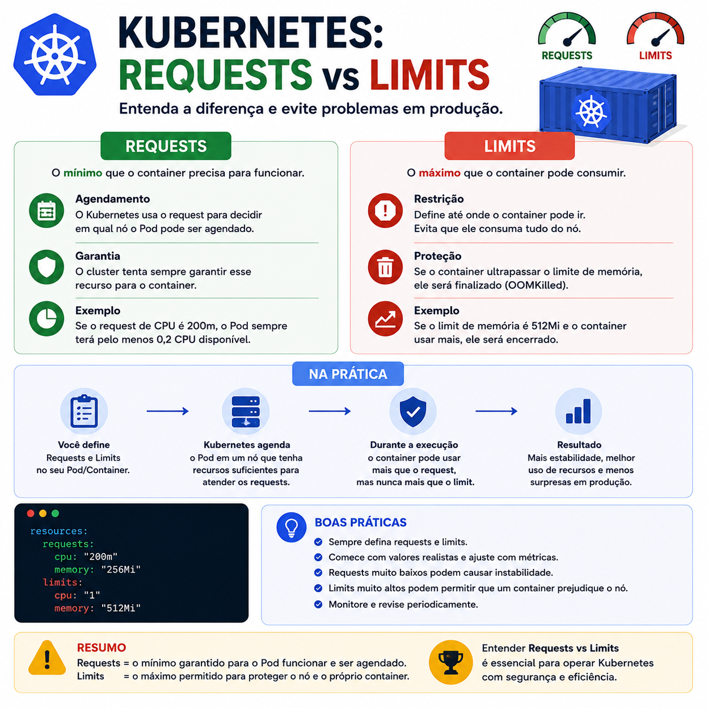

# Kubernetes: Requests vs Limits

> 🟡 **Intermediário** • ⏱️ **7 min de leitura**
>
> **Tecnologias:** Kubernetes • Containers • DevOps



!!! info "Neste artigo você verá"

    Ao final deste artigo você será capaz de:

    - Entender a diferença entre Requests e Limits.
    - Compreender como o Scheduler utiliza os Requests.
    - Descobrir por que Limits ajudam a proteger o cluster.
    - Conhecer boas práticas para definir esses valores.

---

## O problema

Uma das configurações mais importantes de um container no Kubernetes também é uma das mais mal compreendidas.

É comum encontrar aplicações executando sem **Requests** ou **Limits**, ou com valores definidos de forma arbitrária.

O resultado pode variar desde desperdício de recursos até problemas como containers finalizados por falta de memória (`OOMKilled`), degradação de desempenho e baixa utilização do cluster.

---

## Por que isso importa?

O Kubernetes precisa decidir em qual nó cada Pod será executado.

Para tomar essa decisão, ele utiliza principalmente os **Requests**.

Depois que o Pod está em execução, os **Limits** definem até onde aquele container pode consumir recursos.

Quando esses valores não refletem o comportamento real da aplicação, tanto a estabilidade quanto a eficiência do cluster podem ser comprometidas.

---

## O que são Requests?

Os **Requests** representam a quantidade mínima de recursos que um container necessita para ser agendado.

Esses valores são utilizados pelo Scheduler para encontrar um nó que possua capacidade suficiente.

Exemplo:

```yaml
resources:
  requests:
    cpu: "500m"
    memory: "512Mi"
```

Nesse caso, o Kubernetes reservará pelo menos:

- **500 millicores de CPU**
- **512 MiB de memória**

Isso não significa que o container consumirá exatamente esses recursos.

Significa apenas que eles precisam estar disponíveis para que o Pod seja iniciado.

---

## O que são Limits?

Os **Limits** definem o consumo máximo permitido para o container.

Exemplo:

```yaml
resources:
  limits:
    cpu: "1"
    memory: "1Gi"
```

Nesse cenário:

- o container poderá utilizar até **1 CPU**;
- poderá consumir até **1 GiB de memória**.

Caso ultrapasse o limite de memória, o Kubernetes poderá finalizar o processo, gerando um evento de **OOMKilled**.

Já o limite de CPU normalmente resulta em limitação ("throttling") do uso do processador, sem encerrar o container.

---

## Requests × Limits

Uma forma simples de visualizar a diferença é:

| Requests | Limits |
|-----------|---------|
| Definem o mínimo necessário | Definem o máximo permitido |
| Utilizados pelo Scheduler | Aplicados durante a execução |
| Garantem recursos para iniciar o Pod | Evitam consumo excessivo |
| Influenciam o agendamento | Protegem o cluster |

Embora estejam relacionados, eles possuem objetivos completamente diferentes.

---

## O que acontece quando são configurados incorretamente?

### Requests muito baixos

- agendamento inadequado;
- maior concorrência por recursos;
- degradação de desempenho.

### Requests muito altos

- desperdício de capacidade;
- menor densidade de Pods;
- aumento do custo da infraestrutura.

### Limits muito baixos

- processos finalizados por falta de memória;
- CPU limitada excessivamente;
- perda de desempenho.

### Limits muito altos

- risco de um único container consumir recursos em excesso;
- menor previsibilidade do comportamento do cluster.

---

## Como definir os valores?

Não existe uma configuração universal.

O ideal é observar o comportamento da aplicação em produção ou em ambientes de teste utilizando métricas reais.

Ferramentas de monitoramento ajudam a identificar:

- consumo médio de CPU;
- picos de utilização;
- uso de memória;
- crescimento ao longo do tempo.

Essas informações permitem ajustar Requests e Limits de forma muito mais precisa.

---

## Boas práticas

Algumas recomendações costumam gerar bons resultados:

- definir Requests para todos os containers;
- configurar Limits de acordo com o comportamento observado;
- monitorar continuamente CPU e memória;
- revisar configurações após mudanças importantes na aplicação;
- evitar copiar valores entre serviços sem validação.

Os recursos devem refletir a realidade da aplicação, não um valor escolhido por conveniência.

---

## Na prática

Imagine uma API que normalmente utiliza apenas **250 MiB** de memória, mas em horários de pico chega a **700 MiB**.

Configurar um **Request** de **256 MiB** garante que o Pod possa ser agendado corretamente.

Já um **Limit** de **1 GiB** permite absorver esses picos sem que o processo seja encerrado por falta de memória.

Se o limite fosse configurado em **512 MiB**, a aplicação poderia sofrer eventos de **OOMKilled** justamente nos momentos de maior utilização.

Esse tipo de ajuste só é possível quando as configurações são baseadas em métricas reais, e não em estimativas.

---

## Conclusão

Requests e Limits possuem objetivos diferentes, mas trabalham em conjunto para manter o cluster estável e eficiente.

Enquanto os Requests informam ao Kubernetes quais recursos são necessários para iniciar um Pod, os Limits impedem que um container utilize recursos além do esperado.

Mais importante do que definir qualquer valor é acompanhar o comportamento da aplicação e ajustar essas configurações continuamente.

No Kubernetes, monitoramento e configuração caminham lado a lado.

---

## Continue aprendendo

Se este assunto foi útil para você, recomendo também:

- Kubernetes: afinal, o que é um Pod?
- Observabilidade
- Circuit Breaker + Retry
- Amazon SQS

---

## Referências

- Kubernetes Documentation — Resource Management for Pods and Containers
- Kubernetes Documentation — Configure Memory and CPU Resources
- Kubernetes Documentation — Scheduler