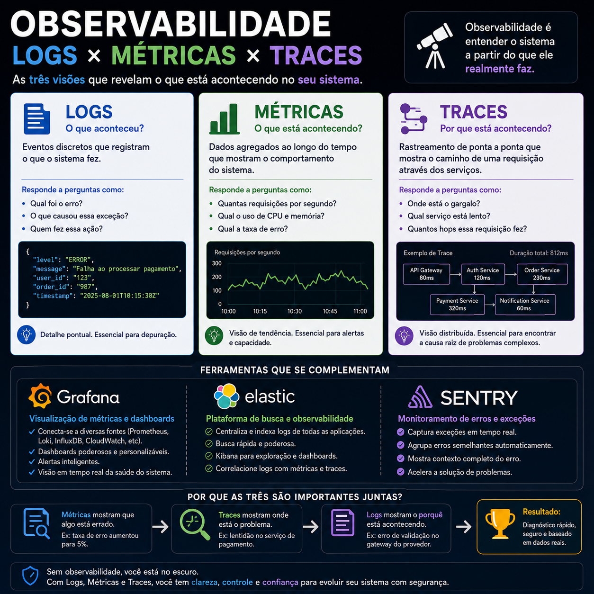

# Observabilidade: muito além de armazenar logs

> 🟡 **Intermediário** • ⏱️ **8 min de leitura**
>
> **Tecnologias:** Observabilidade • Grafana • Elastic • Sentry



!!! info "Neste artigo você verá"

    Ao final deste artigo você será capaz de:

    - Entender os três pilares da observabilidade.
    - Diferenciar Logs, Métricas e Traces.
    - Conhecer ferramentas amplamente utilizadas para monitoramento.
    - Compreender como essas informações ajudam na investigação de incidentes.

---

## O problema

Imagine que um usuário informe que uma funcionalidade está lenta.

Por onde começar?

Consultar apenas os logs pode não ser suficiente.

Olhar apenas métricas também pode não revelar a causa.

E saber apenas que uma exceção ocorreu nem sempre explica em qual etapa do processamento ela aconteceu.

Quando um sistema cresce, diferentes tipos de informação passam a ser necessários para compreender seu comportamento.

É justamente esse o objetivo da observabilidade.

---

## Por que isso importa?

Quanto mais tempo uma equipe leva para identificar a causa de um problema, maior tende a ser o impacto para os usuários e para o negócio.

Observabilidade permite responder perguntas como:

- O que aconteceu?
- Quando aconteceu?
- Onde aconteceu?
- Qual serviço foi afetado?
- O problema ainda está ocorrendo?

Responder essas perguntas rapidamente reduz o tempo de diagnóstico e acelera a recuperação do sistema.

---

## Os três pilares da observabilidade

A observabilidade moderna normalmente é construída sobre três pilares.

### 📄 Logs

Os logs registram eventos ocorridos durante a execução da aplicação.

Eles ajudam a entender **o que aconteceu**.

Exemplos:

- início e fim de uma operação;
- mensagens de erro;
- exceções;
- integrações realizadas;
- informações de auditoria.

São fundamentais durante investigações e análises de comportamento.

---

### 📊 Métricas

Métricas representam valores numéricos coletados continuamente ao longo do tempo.

Elas mostram **como o sistema está se comportando**.

Alguns exemplos:

- uso de CPU;
- consumo de memória;
- latência;
- quantidade de requisições;
- taxa de erro;
- disponibilidade.

Essas informações ajudam a identificar tendências e detectar degradações antes que usuários percebam o problema.

---

### 🔍 Traces

Traces acompanham o caminho percorrido por uma requisição entre diferentes serviços.

Eles respondem perguntas como:

- Qual etapa ficou lenta?
- Em qual serviço ocorreu a falha?
- Quanto tempo cada operação consumiu?

Em arquiteturas distribuídas, traces são essenciais para entender o comportamento completo de uma requisição.

---

## Ferramentas populares

Diversas ferramentas ajudam a implementar observabilidade.

### Grafana

O Grafana é amplamente utilizado para visualizar métricas por meio de dashboards interativos.

Ele facilita o acompanhamento de indicadores e permite criar alertas baseados em métricas importantes.

---

### Elastic

A Elastic Stack (Elasticsearch, Logstash e Kibana) é bastante utilizada para indexação, pesquisa e análise de logs.

Sua capacidade de busca torna investigações muito mais rápidas.

---

### Sentry

O Sentry é especializado no monitoramento de exceções e erros em tempo real.

Além de registrar falhas, ele fornece contexto suficiente para facilitar sua reprodução e correção.

---

## Como essas ferramentas trabalham juntas?

Cada ferramenta responde perguntas diferentes.

Um fluxo típico pode ser representado assim:

```text
Usuário relata lentidão
          │
          ▼
Grafana
Existe aumento na latência?
          │
          ▼
Elastic
Quais logs foram registrados?
          │
          ▼
Sentry
Houve alguma exceção?
          │
          ▼
Trace
Em qual serviço ocorreu o problema?
```

Em conjunto, essas informações reduzem significativamente o tempo necessário para investigar incidentes.

---

## Quando utilizar

Observabilidade é especialmente importante em aplicações que:

- possuem múltiplos serviços;
- atendem muitos usuários;
- executam integrações externas;
- precisam de alta disponibilidade;
- realizam deploys frequentes.

Quanto maior a complexidade do sistema, maior o valor de uma boa estratégia de observabilidade.

---

## Boas práticas

Algumas recomendações ajudam bastante:

- registrar logs estruturados;
- definir métricas relevantes para o negócio;
- utilizar correlação entre logs e traces;
- configurar alertas acionáveis;
- evitar registrar informações sensíveis;
- monitorar continuamente a saúde dos serviços.

Observabilidade não é apenas coletar dados, mas garantir que eles sejam úteis durante uma investigação.

---

## Na prática

Imagine que uma API começou a responder lentamente após um deploy.

O Grafana mostra um aumento expressivo na latência.

Os logs centralizados na Elastic revelam que as consultas ao banco de dados passaram a demorar mais.

Ao analisar os traces, a equipe identifica que uma única chamada entre serviços representa a maior parte do tempo da requisição.

Sem precisar fazer suposições, é possível localizar rapidamente a origem do problema e direcionar os esforços para corrigi-lo.

---

## Conclusão

Observabilidade vai muito além de armazenar logs.

Ela combina diferentes fontes de informação para oferecer uma visão completa do comportamento da aplicação.

Logs mostram o que aconteceu.

Métricas mostram como o sistema está se comportando.

Traces mostram onde a requisição passou e em qual etapa ocorreu a lentidão ou falha.

Ferramentas como Grafana, Elastic e Sentry tornam esse processo muito mais eficiente, permitindo que equipes respondam rapidamente a incidentes e mantenham aplicações mais confiáveis.

---

## Continue aprendendo

Se este assunto foi útil para você, recomendo também:

- Circuit Breaker + Retry
- Deu ruim em produção. E agora?
- Kubernetes: Requests vs Limits
- Event-Driven Architecture

---

## Referências

- OpenTelemetry Documentation
- Grafana Documentation
- Elastic Documentation
- Sentry Documentation
- Site Reliability Engineering — Google