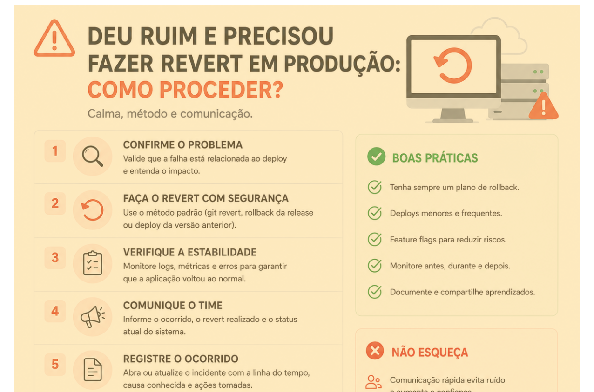

# Deu ruim em produção. E agora?

> 🟡 **Intermediário** • ⏱️ **6 min de leitura**
>
> **Tecnologias:** DevOps • Deploy • Incident Management

!!! info "Neste artigo você verá"

    Ao final deste artigo você será capaz de:

    - Entender quando um revert é a melhor decisão.
    - Saber como agir durante um incidente em produção.
    - Reduzir o impacto para os usuários.
    - Diferenciar a contenção do problema da investigação da causa raiz.

---

## O problema

Poucos momentos geram tanta tensão quanto perceber que um deploy acabou de causar problemas em produção.

Erros começam a aparecer, métricas pioram, usuários reportam falhas e a pressão para resolver tudo rapidamente aumenta.

Nessas situações, a pior decisão costuma ser tentar corrigir tudo diretamente em produção, sem entender completamente o problema.

---

## Por que isso importa?

Uma aplicação instável afeta usuários, equipes de suporte e, muitas vezes, o próprio negócio.

Quanto maior o tempo de indisponibilidade ou comportamento incorreto, maior tende a ser o impacto.

Por isso, o principal objetivo durante um incidente não é encontrar imediatamente a causa do problema.

É restaurar a estabilidade do sistema o mais rápido possível.

---

## O papel do revert

Fazer um revert não significa admitir derrota.

Significa reconhecer que a versão anterior era mais estável e que, naquele momento, o menor risco é retornar a ela.

Em muitos cenários, essa é justamente a decisão mais responsável.

Depois que a estabilidade é recuperada, a equipe pode investigar o problema com calma e segurança.

---

## Como agir durante um incidente?

Embora cada empresa possua seu próprio processo, um fluxo bastante comum é:

1. Confirmar que o problema realmente foi causado pelo deploy.
2. Acionar o procedimento padrão de rollback ou revert.
3. Monitorar logs, métricas e erros após o retorno da versão anterior.
4. Comunicar rapidamente o status para as equipes envolvidas.
5. Registrar o incidente.
6. Investigar a causa raiz.
7. Corrigir, testar e realizar um novo deploy.

Perceba que o objetivo inicial é conter o impacto, e não resolver tudo imediatamente.

---

## Benefícios de um revert rápido

Quando o procedimento é bem definido, diversos benefícios aparecem:

- redução do tempo de indisponibilidade;
- menor impacto para os usuários;
- menos pressão durante a investigação;
- ambiente mais seguro para analisar o problema;
- maior confiança no processo de deploy.

O foco deixa de ser "consertar em produção" e passa a ser "restabelecer o serviço".

---

## Quando utilizar

Um revert costuma ser uma boa alternativa quando:

- o deploy introduziu regressões críticas;
- existe indisponibilidade significativa;
- não há uma correção rápida e segura;
- a versão anterior é conhecida por ser estável.

Nesses casos, retornar para a última versão funcional normalmente representa o menor risco.

---

## Quando evitar

Nem todo problema exige um rollback.

Algumas situações podem ser resolvidas rapidamente por meio de:

- Feature Flags;
- configurações;
- correções isoladas;
- rollback parcial.

A decisão deve considerar o impacto, o risco e o tempo necessário para restaurar a estabilidade.

---

## Boas práticas

Equipes maduras costumam adotar algumas práticas que tornam incidentes mais fáceis de gerenciar:

- possuir um procedimento de rollback documentado;
- automatizar o processo de deploy e revert sempre que possível;
- monitorar logs, métricas e traces em tempo real;
- registrar incidentes e post-mortems;
- evitar mudanças manuais diretamente em produção.

Quanto mais previsível for o processo, menor tende a ser o impacto dos incidentes.

---

## Na prática

Imagine que uma nova versão aumente significativamente o tempo de resposta da API após o deploy.

Em vez de tentar corrigir o problema diretamente em produção, a equipe executa o rollback previamente documentado.

Em poucos minutos, a aplicação volta a operar normalmente.

Com o ambiente estabilizado, logs, métricas e traces são analisados para identificar a causa raiz antes de uma nova publicação.

Essa abordagem reduz o impacto para os usuários e permite uma investigação muito mais segura.

---

## Conclusão

Incidentes fazem parte da operação de qualquer sistema.

A diferença entre equipes maduras e equipes inexperientes não está em nunca cometer erros, mas em responder a eles de forma organizada.

Reverter uma versão instável não é um fracasso.

É uma estratégia para proteger os usuários, preservar a estabilidade da aplicação e criar espaço para que a causa do problema seja investigada com tranquilidade.

---

## Continue aprendendo

Se este assunto foi útil para você, recomendo também:

- Observabilidade: Logs, Métricas e Traces
- Kubernetes: Requests vs Limits
- Circuit Breaker + Retry
- Feature Flags

---

## Referências

- Google Site Reliability Engineering (SRE)
- Accelerate — Nicole Forsgren, Jez Humble e Gene Kim
- The DevOps Handbook — Gene Kim, Jez Humble, Patrick Debois e John Willis