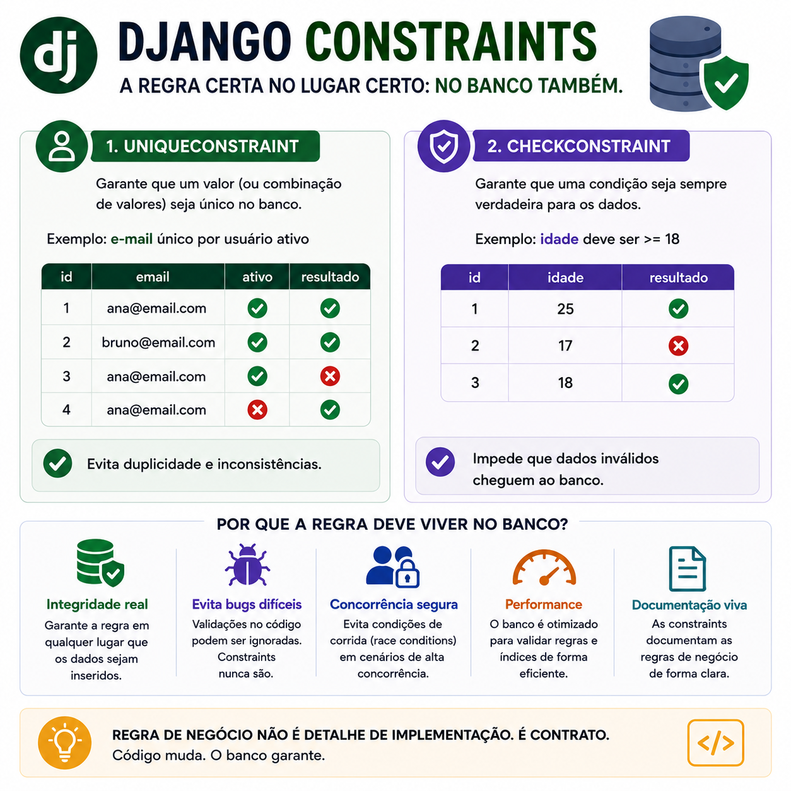

# Django Constraints: por que a regra de negócio também deve viver no banco

> 🟡 **Intermediário** • ⏱️ **7 min de leitura**
>
> **Tecnologias:** Django • Banco de Dados • Integridade de Dados



!!! info "Neste artigo você verá"

    Ao final deste artigo você será capaz de:

    - Entender o que são Constraints no Django.
    - Conhecer as diferenças entre UniqueConstraint e CheckConstraint.
    - Descobrir por que validar apenas na aplicação não é suficiente.
    - Construir aplicações mais seguras e consistentes.

---

## O problema

É muito comum implementar regras de negócio apenas no código da aplicação.

Por exemplo:

- impedir dois usuários com o mesmo e-mail;
- evitar valores negativos;
- garantir que uma data final seja maior que a inicial.

Essas validações funcionam enquanto todas as operações passam pela aplicação.

Mas o que acontece quando outro serviço grava dados diretamente no banco?

Ou quando duas requisições concorrentes executam a mesma validação ao mesmo tempo?

Nesses cenários, confiar apenas na aplicação pode não ser suficiente.

---

## Por que isso importa?

O banco de dados é a última linha de defesa da integridade das informações.

Mesmo que existam múltiplas aplicações, APIs, scripts ou processos acessando a mesma base, as regras continuam sendo aplicadas.

Isso reduz inconsistências e protege o sistema contra cenários difíceis de reproduzir.

---

## O que são Constraints?

Constraints são regras definidas diretamente no banco de dados que impedem a gravação de informações inválidas.

O Django permite criar essas regras por meio da classe `Meta`, tornando-as parte do próprio modelo.

Dessa forma, a regra fica documentada e é aplicada independentemente da origem da operação.

---

## UniqueConstraint

O `UniqueConstraint` garante que determinada combinação de campos seja única.

Exemplo:

```python
from django.db import models

class Usuario(models.Model):
    email = models.EmailField()

    class Meta:
        constraints = [
            models.UniqueConstraint(
                fields=["email"],
                name="unique_email"
            )
        ]
```

Nesse exemplo, dois registros não poderão possuir o mesmo e-mail.

Mesmo que duas requisições concorrentes tentem gravar simultaneamente, o banco impedirá a duplicidade.

---

## CheckConstraint

O `CheckConstraint` garante que uma condição lógica seja sempre verdadeira.

Exemplo:

```python
class Produto(models.Model):
    estoque = models.IntegerField()

    class Meta:
        constraints = [
            models.CheckConstraint(
                check=models.Q(estoque__gte=0),
                name="estoque_maior_igual_zero"
            )
        ]
```

Agora nenhum registro poderá possuir estoque negativo.

A regra passa a ser garantida pelo próprio banco.

---

## Por que validar também no banco?

Imagine que duas requisições sejam recebidas exatamente ao mesmo tempo.

Ambas verificam se determinado e-mail já existe.

Como nenhuma delas encontrou registros, as duas tentam gravar.

Sem uma Constraint, os dois registros podem ser inseridos.

Com um `UniqueConstraint`, apenas uma gravação será aceita.

Esse tipo de proteção é fundamental em cenários concorrentes.

---

## Benefícios

Utilizar Constraints traz diversas vantagens:

- maior integridade dos dados;
- redução de inconsistências;
- proteção contra condições de corrida (*race conditions*);
- regras centralizadas;
- documentação da regra de negócio;
- maior segurança para integrações entre sistemas.

O banco deixa de ser apenas um local de armazenamento e passa a participar ativamente da validação.

---

## Quando utilizar

Constraints fazem bastante sentido para regras que nunca devem ser violadas.

Alguns exemplos:

- e-mails únicos;
- CPF ou CNPJ sem duplicidade;
- estoque não negativo;
- datas consistentes;
- limites mínimos e máximos;
- combinações únicas de campos.

Sempre que a integridade dos dados for importante, vale considerar uma Constraint.

---

## Quando evitar

Nem toda regra de negócio pertence ao banco.

Validações que dependem de contexto, permissões, integrações externas ou fluxos complexos continuam sendo responsabilidade da aplicação.

As Constraints devem ser utilizadas para garantir regras estruturais e invariantes dos dados.

---

## Boas práticas

Algumas recomendações ajudam bastante:

- validar também na aplicação para oferecer mensagens amigáveis ao usuário;
- utilizar nomes descritivos para as Constraints;
- manter as regras próximas dos modelos;
- criar migrações sempre que novas Constraints forem adicionadas;
- revisar Constraints durante a evolução do domínio.

A validação na aplicação melhora a experiência do usuário.

A Constraint garante a integridade dos dados.

As duas abordagens se complementam.

---

## Na prática

Imagine um sistema de assinaturas onde o e-mail do cliente deve ser único.

A API já realiza essa validação antes de salvar.

Mesmo assim, durante um pico de acesso, duas requisições chegam praticamente ao mesmo tempo.

Sem um `UniqueConstraint`, ambas poderiam gravar o mesmo e-mail.

Com a Constraint definida no banco, apenas uma operação será concluída com sucesso.

A regra continua sendo respeitada, independentemente da concorrência ou da origem da gravação.

---

## Conclusão

Validar regras de negócio apenas na aplicação pode ser suficiente em cenários simples.

Mas, à medida que sistemas crescem e múltiplos processos passam a compartilhar o mesmo banco de dados, garantir essas regras diretamente na base torna-se essencial.

`UniqueConstraint` e `CheckConstraint` ajudam a preservar a integridade dos dados, reduzem inconsistências e tornam a aplicação mais robusta.

No fim, código pode mudar.

As regras que garantem a consistência dos dados devem continuar sendo respeitadas.

---

## Continue aprendendo

Se este assunto foi útil para você, recomendo também:

- Pydantic
- Idempotência
- Exists, OuterRef e annotate
- select_related vs prefetch_related

---

## Referências

- Django Documentation — Model Constraints
- PostgreSQL Documentation — Constraints
- Designing Data-Intensive Applications — Martin Kleppmann