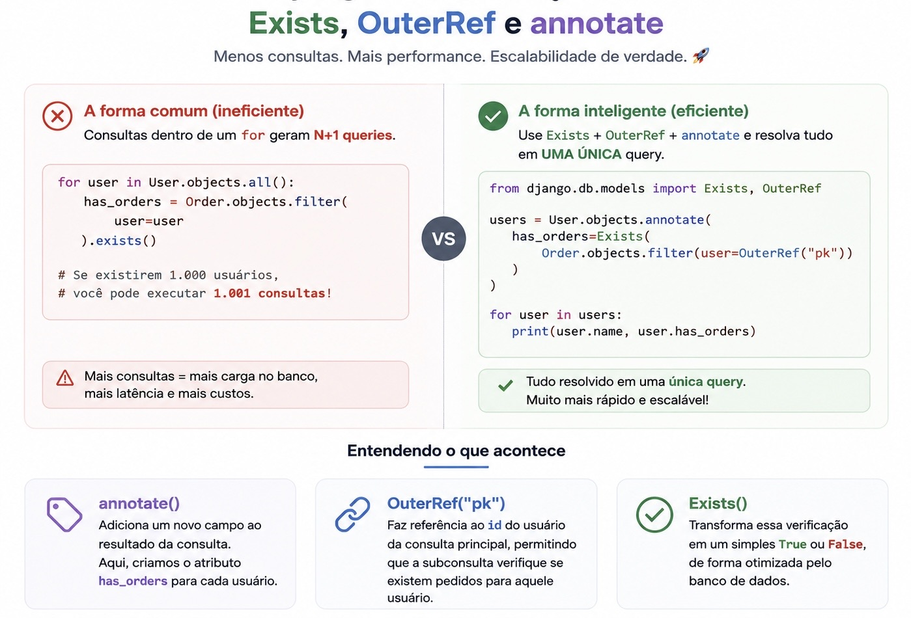

# Exists, OuterRef e annotate: consultas avançadas no Django ORM

> 🔴 Avançado • ⏱️ 7 min de leitura
>
> **Tecnologias:** Python • Django ORM • PostgreSQL



## O problema

É muito comum encontrar códigos como este:

```python
for customer in customers:
    customer.has_orders = Order.objects.filter(
        customer=customer
    ).exists()
```

Apesar de simples, essa abordagem executa uma consulta para cada cliente.

Se a lista possui 1.000 registros, serão realizadas **1.001 consultas** ao banco de dados.

Esse problema é conhecido como **N+1 Queries** e pode causar impactos significativos em aplicações de larga escala.

---

## A solução

O Django ORM possui recursos extremamente poderosos para mover essa lógica para uma única consulta SQL.

A combinação entre **Exists**, **OuterRef** e **annotate** permite enriquecer os objetos retornados pelo banco sem executar consultas adicionais.

```python
from django.db.models import Exists, OuterRef

customers = Customer.objects.annotate(
    has_orders=Exists(
        Order.objects.filter(customer=OuterRef("pk"))
    )
)
```

Agora cada objeto `Customer` possuirá um novo atributo:

```python
customer.has_orders
```

Tudo isso utilizando apenas **uma única consulta**.

---

## O que faz cada recurso?

### Exists

Executa uma subconsulta retornando apenas um valor booleano.

É muito mais eficiente do que contar registros quando o objetivo é apenas saber se eles existem.

```python
Exists(
    Order.objects.filter(customer=OuterRef("pk"))
)
```

---

### OuterRef

Permite que a subconsulta faça referência ao registro da consulta principal.

Neste exemplo:

```python
OuterRef("pk")
```

o Django entende que deve comparar o cliente atual da consulta principal com os pedidos existentes.

Sem o `OuterRef`, a subconsulta não teria acesso ao objeto externo.

---

### annotate

Adiciona novos campos ao resultado da consulta.

Esses campos não existem na tabela, mas passam a fazer parte dos objetos retornados pelo ORM.

```python
customers = Customer.objects.annotate(
    has_orders=...
)
```

Depois disso, basta utilizar normalmente:

```python
customer.has_orders
```

sem gerar novas consultas ao banco.

---

## Benefícios

Utilizar essa abordagem traz diversas vantagens:

- reduz drasticamente a quantidade de consultas SQL;
- diminui a carga no banco de dados;
- reduz latência das requisições;
- melhora a escalabilidade da aplicação;
- mantém toda a lógica concentrada no banco.

Em sistemas distribuídos, onde milhares de requisições são processadas por minuto, essa otimização pode representar uma diferença significativa na utilização dos recursos da infraestrutura.

---

## Quando utilizar

Essa combinação é especialmente útil quando você precisa:

- verificar se registros relacionados existem;
- adicionar indicadores booleanos aos objetos retornados;
- evitar consultas dentro de loops;
- construir APIs mais performáticas;
- otimizar listagens administrativas.

---

## Quando evitar

Nem toda consulta precisa utilizar subqueries.

Para relacionamentos simples, recursos como `select_related()` e `prefetch_related()` continuam sendo a melhor escolha.

Já `Exists` e `OuterRef` brilham quando o objetivo é responder perguntas como:

- "Existe pagamento pendente?"
- "Existe pedido em aberto?"
- "Existe assinatura ativa?"

sem precisar carregar todos os registros relacionados.

---

## Conclusão

O Django ORM oferece recursos extremamente avançados que muitas vezes passam despercebidos.

Dominar ferramentas como **Exists**, **OuterRef** e **annotate** permite escrever consultas mais elegantes, reduzir a carga sobre o banco de dados e construir aplicações mais eficientes.

Em sistemas de larga escala, pequenas otimizações como essa podem representar uma enorme diferença na performance geral da aplicação.