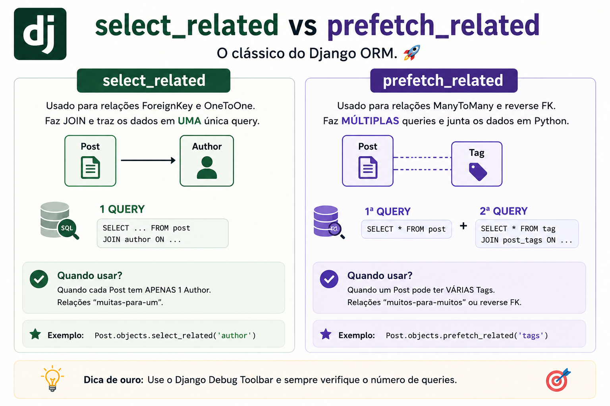

# select_related vs prefetch_related: qual a diferença?

> 🟡 **Intermediário** • ⏱️ **7 min de leitura**
>
> **Tecnologias:** Python • Django ORM • SQL



!!! info "Neste artigo você verá"

    Ao final deste artigo você será capaz de:

    - Entender a diferença entre select_related e prefetch_related.
    - Saber quando utilizar cada um.
    - Evitar consultas N+1.
    - Melhorar a performance do Django ORM.

---

## O problema

Uma aplicação Django pode funcionar perfeitamente durante o desenvolvimento e, ainda assim, apresentar problemas de desempenho quando o volume de dados cresce.

Um dos motivos mais comuns é o chamado **problema N+1**.

Imagine listar 100 pedidos e, para cada um deles, buscar o cliente correspondente.

Em vez de executar apenas uma consulta, a aplicação acaba realizando **101 queries**.

É justamente esse tipo de situação que `select_related` e `prefetch_related` ajudam a evitar.

---

## Por que isso importa?

Cada consulta ao banco possui um custo.

Quanto maior o número de queries executadas, maior tende a ser a latência da aplicação.

Reduzir consultas desnecessárias costuma trazer ganhos significativos de desempenho sem alterar a regra de negócio.

---

## O que é select_related?

O `select_related()` realiza um **JOIN** no banco de dados.

Ele funciona para relacionamentos:

- ForeignKey
- OneToOneField

Como tudo é obtido em uma única consulta SQL, essa costuma ser a opção mais eficiente para esses tipos de relacionamento.

Exemplo:

```python
pedidos = Pedido.objects.select_related("cliente")
```

SQL simplificado:

```sql
SELECT *
FROM pedido
JOIN cliente
ON pedido.cliente_id = cliente.id;
```

Apenas **uma query** é enviada ao banco.

---

## O que é prefetch_related?

O `prefetch_related()` segue outra estratégia.

Em vez de utilizar JOINs, o Django executa consultas separadas e depois associa os objetos em memória.

Ele é indicado para:

- ManyToMany
- relacionamentos reversos
- conjuntos com múltiplos registros relacionados

Exemplo:

```python
autores = Autor.objects.prefetch_related("livros")
```

Fluxo simplificado:

```text
Query 1 → Autores

Query 2 → Livros

Django associa os dados em memória
```

Essa abordagem evita duplicação excessiva de registros causada por JOINs em relacionamentos "muitos para muitos".

---

## Quando utilizar cada um?

Uma regra prática costuma resolver a maior parte dos casos:

| Relacionamento | Método recomendado |
|----------------|-------------------|
| ForeignKey | `select_related()` |
| OneToOne | `select_related()` |
| ManyToMany | `prefetch_related()` |
| Relacionamento reverso | `prefetch_related()` |

Essa não é uma regra absoluta, mas representa a recomendação para a maioria dos cenários.

---

## Eles podem ser utilizados juntos?

Sim.

É bastante comum combinar os dois métodos na mesma consulta.

Exemplo:

```python
Pedido.objects.select_related(
    "cliente"
).prefetch_related(
    "itens"
)
```

Nesse caso:

- o cliente é carregado utilizando JOIN;
- os itens são buscados em consultas separadas.

Cada relacionamento utiliza a estratégia mais adequada.

---

## Benefícios

Utilizar corretamente esses métodos proporciona:

- menos consultas ao banco;
- redução do problema N+1;
- menor latência;
- melhor utilização do banco de dados;
- aplicações mais escaláveis.

Em sistemas com grande volume de acessos, essa otimização faz bastante diferença.

---

## Quando evitar

Nem sempre adicionar `select_related()` ou `prefetch_related()` melhora a performance.

Buscar relacionamentos que nunca serão utilizados apenas aumenta o consumo de memória e pode tornar a consulta mais pesada.

A otimização deve ser feita de acordo com a necessidade da aplicação.

---

## Boas práticas

Algumas recomendações ajudam bastante:

- medir a quantidade de queries durante o desenvolvimento;
- utilizar Django Debug Toolbar para identificar consultas desnecessárias;
- carregar apenas relacionamentos realmente utilizados;
- combinar `select_related()` e `prefetch_related()` quando fizer sentido;
- revisar consultas críticas periodicamente.

Performance deve ser medida, não presumida.

---

## Na prática

Imagine uma tela que lista pedidos e exibe o nome do cliente.

Sem `select_related()`, cada acesso a `pedido.cliente.nome` pode gerar uma nova consulta ao banco.

Com `select_related("cliente")`, todas essas informações são obtidas em uma única query.

Agora imagine uma tela que exibe autores e todos os seus livros.

Nesse cenário, `prefetch_related("livros")` costuma ser a melhor escolha, pois evita um JOIN que poderia multiplicar registros e aumentar desnecessariamente o volume de dados retornado.

---

## Conclusão

Embora possuam objetivos semelhantes, `select_related()` e `prefetch_related()` utilizam estratégias completamente diferentes.

O primeiro utiliza JOINs para relacionamentos simples.

O segundo realiza consultas independentes e associa os resultados em memória.

Conhecer essa diferença ajuda a escrever consultas mais eficientes e evitar um dos problemas de desempenho mais comuns em aplicações Django.

---

## Continue aprendendo

Se este assunto foi útil para você, recomendo também:

- Django Constraints
- Exists, OuterRef e annotate
- Pydantic
- Redis: muito além do cache

---

## Referências

- Django Documentation — QuerySet API Reference
- Django Documentation — Optimization
- Two Scoops of Django — Daniel Roy Greenfeld e Audrey Roy Greenfeld