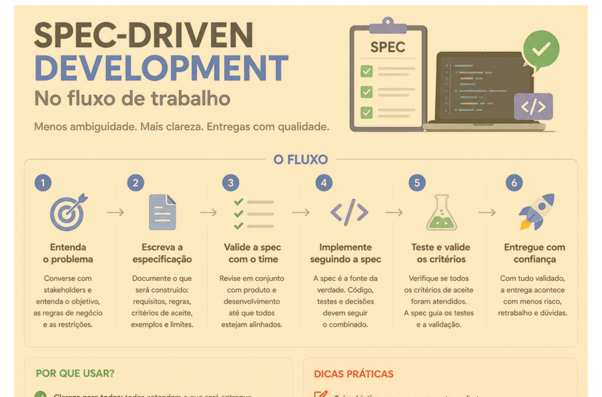

# Spec-Driven Development: desenvolvendo software a partir de boas especificações

> 🟢 **Iniciante** • ⏱️ **6 min de leitura**
>
> **Tecnologias:** Engenharia de Software • Produto • Desenvolvimento Backend

!!! info "Neste artigo você verá"

    Ao final deste artigo você será capaz de:

    - Entender o conceito de Spec-Driven Development.
    - Compreender por que boas especificações reduzem retrabalho.
    - Saber quais informações uma boa especificação deve conter.
    - Identificar os benefícios dessa abordagem para times de desenvolvimento.

---

## O problema

Escrever código sem uma boa especificação é como construir uma casa sem planta.

Cada desenvolvedor interpreta o problema de uma maneira diferente, faz suposições próprias e implementa aquilo que acredita ser o comportamento esperado.

O resultado costuma ser conhecido por qualquer equipe de engenharia:

- retrabalho;
- dúvidas durante a implementação;
- requisitos alterados no meio do desenvolvimento;
- desalinhamento entre Produto e Engenharia;
- dificuldade para validar a entrega.

---

## Por que isso importa?

Quanto mais tarde uma dúvida é descoberta, maior tende a ser o custo para corrigi-la.

Uma funcionalidade implementada com base em premissas incorretas pode exigir mudanças em código, testes, documentação e até na experiência do usuário.

Investir tempo na especificação antes do desenvolvimento costuma ser muito mais barato do que corrigir problemas depois que a implementação já começou.

---

## O que é Spec-Driven Development?

Spec-Driven Development é uma abordagem em que a especificação deixa de ser apenas um documento de apoio e passa a orientar todo o desenvolvimento.

Antes da implementação, a equipe busca construir um entendimento comum sobre o problema que será resolvido.

O foco não está apenas em **como desenvolver**, mas principalmente em **o que precisa ser desenvolvido e por quê**.

---

## Como funciona?

Embora cada equipe adapte o processo à sua realidade, um fluxo bastante comum é:

1. Compreender o problema de negócio.
2. Levantar contexto e regras funcionais.
3. Definir requisitos e critérios de aceite.
4. Validar a especificação com Produto e Engenharia.
5. Somente então iniciar a implementação.

Essa abordagem reduz ambiguidades e garante que todos trabalhem com o mesmo entendimento desde o início.

---

## O que uma boa especificação deve conter?

Uma boa especificação normalmente responde perguntas como:

- Qual problema estamos resolvendo?
- Qual é o objetivo da funcionalidade?
- Quais são as regras de negócio?
- Existem exceções?
- Como será validado que a funcionalidade está pronta?
- Existem impactos em outras áreas do sistema?

Quanto mais claras forem essas respostas, menor será o espaço para interpretações diferentes.

---

## Benefícios

Adotar uma cultura orientada por especificações traz diversas vantagens:

- reduz retrabalho;
- diminui dúvidas durante o desenvolvimento;
- melhora a comunicação entre Produto e Engenharia;
- aumenta a previsibilidade das entregas;
- facilita revisões técnicas;
- melhora a qualidade da documentação.

---

## Quando utilizar

Essa abordagem é especialmente útil em projetos que possuem:

- regras de negócio complexas;
- múltiplos times envolvidos;
- integrações entre sistemas;
- produtos em constante evolução.

Mesmo em projetos menores, uma especificação objetiva costuma evitar boa parte dos desalinhamentos.

---

## Quando evitar

Spec-Driven Development não significa criar documentos longos ou burocráticos.

O objetivo é gerar clareza, e não produzir documentação excessiva.

Uma especificação simples, objetiva e compartilhada costuma gerar mais valor do que dezenas de páginas que ninguém consulta.

---

## Na prática

Imagine que Produto solicite uma nova regra para cobrança de assinaturas.

Sem uma especificação clara, diferentes desenvolvedores podem interpretar de maneiras distintas quando aplicar a regra, quais exceções considerar e como tratar cenários já existentes.

Com uma especificação validada previamente, todos trabalham com o mesmo entendimento, reduzindo dúvidas durante a implementação e aumentando a previsibilidade da entrega.

---

## Conclusão

Spec-Driven Development não é sobre escrever mais documentos.

É sobre criar um entendimento compartilhado antes de escrever código.

Quanto melhor a especificação, menores são as chances de interpretações diferentes, retrabalho e mudanças inesperadas durante o desenvolvimento.

No fim, o maior benefício não é apenas entregar software mais rapidamente, mas entregar a solução correta.

---

## Continue aprendendo

Se este assunto foi interessante para você, recomendo também:

- Changelog: vale a pena?
- Como desenvolvedores podem contribuir nos refinamentos com Produto
- A importância da documentação para humanos e IA

---

## Referências

- Domain-Driven Design — Eric Evans
- Team Topologies — Matthew Skelton e Manuel Pais
- Software Requirements — Karl Wiegers