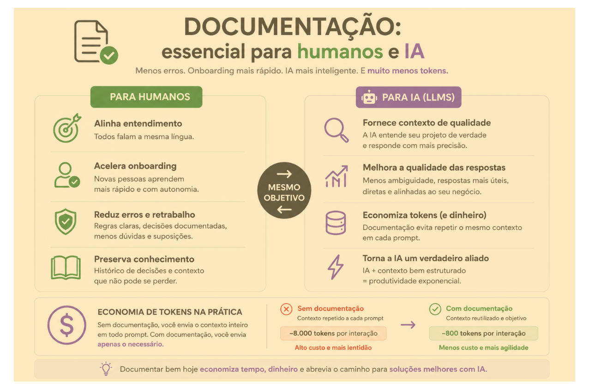

# Documentação para humanos e Inteligência Artificial

Documentação não é apenas uma boa prática para ajudar pessoas.

No cenário atual, ela também fornece contexto para ferramentas de Inteligência Artificial.

## Por que documentar?

Uma boa documentação:

- reduz erros e retrabalho;
- acelera o onboarding;
- preserva decisões técnicas;
- melhora a qualidade das respostas de LLMs;
- reduz o consumo de tokens.

## Documentação e economia de tokens

Quando o contexto do projeto está organizado, não é necessário explicar todo o sistema novamente em cada prompt.

A IA recebe apenas as informações relevantes para a tarefa.

Isso reduz:

- tamanho dos prompts;
- consumo de tokens;
- custo das interações;
- respostas genéricas ou desalinhadas.

## Conclusão

Documentação deixou de ser apenas uma prática para humanos.

Ela também passou a ser uma importante fonte de contexto para sistemas de IA.

