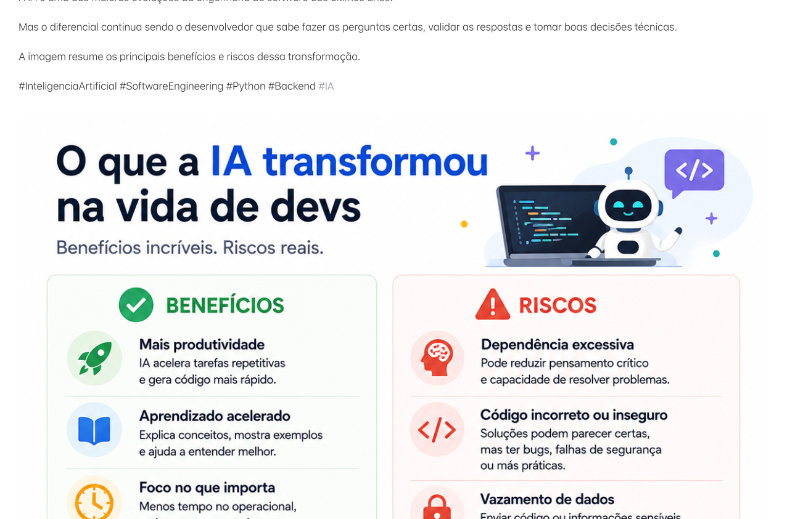

# O que a IA transformou na vida dos desenvolvedores de software

> 🟢 **Iniciante** • ⏱️ **7 min de leitura**
>
> **Tecnologias:** Inteligência Artificial • Engenharia de Software • Desenvolvimento Backend

!!! info "Neste artigo você verá"

    Ao final deste artigo você será capaz de:

    - Entender como a IA mudou o desenvolvimento de software.
    - Conhecer os principais benefícios dessas ferramentas.
    - Identificar os riscos do uso indiscriminado da IA.
    - Compreender por que a engenharia continua sendo essencial.

---

## O problema

Nos últimos anos, a Inteligência Artificial deixou de ser uma tecnologia experimental e passou a fazer parte da rotina de milhares de desenvolvedores.

Hoje é possível gerar código, escrever testes, documentar APIs, revisar implementações e explicar mensagens de erro em poucos segundos.

Essa mudança aumentou significativamente a produtividade, mas também trouxe novos desafios.

O maior deles talvez seja acreditar que produzir código mais rápido significa, automaticamente, produzir software melhor.

---

## Por que isso importa?

A IA acelera diversas tarefas do desenvolvimento.

No entanto, ela não compreende profundamente o contexto do negócio, os objetivos do produto ou todas as restrições técnicas de uma aplicação.

Ainda cabe ao desenvolvedor decidir se uma solução faz sentido, é segura, escalável e adequada para o problema que está sendo resolvido.

Quanto maior o poder da ferramenta, maior também a responsabilidade de quem a utiliza.

---

## Como a IA mudou o desenvolvimento?

Ferramentas baseadas em IA passaram a apoiar atividades que antes consumiam bastante tempo.

Hoje elas conseguem auxiliar em tarefas como:

- geração de código;
- criação de testes automatizados;
- documentação de APIs;
- explicação de mensagens de erro;
- sugestões de refatoração;
- criação de consultas SQL;
- geração de scripts;
- aprendizado de novas tecnologias.

Isso permite que o desenvolvedor concentre mais tempo na arquitetura, na resolução de problemas complexos e nas decisões técnicas.

---

## Os principais benefícios

Quando utilizada de forma consciente, a IA traz ganhos importantes:

- aumento da produtividade;
- redução de tarefas repetitivas;
- aprendizado acelerado de novas tecnologias;
- apoio na investigação de problemas;
- auxílio na documentação;
- geração rápida de protótipos.

Ela funciona como uma excelente assistente para diversas atividades do dia a dia.

---

## Os principais riscos

Ao mesmo tempo, algumas armadilhas merecem atenção.

Entre elas:

- aceitar código sem revisar;
- depender da ferramenta para decisões técnicas;
- introduzir vulnerabilidades de segurança;
- compartilhar informações sensíveis em prompts;
- deixar de exercitar pensamento crítico.

A velocidade proporcionada pela IA nunca deve substituir a validação humana.

---

## Quando utilizar

A IA costuma gerar bastante valor em atividades como:

- esclarecer dúvidas técnicas;
- produzir exemplos de código;
- revisar implementações;
- automatizar tarefas repetitivas;
- resumir documentação;
- acelerar estudos e pesquisas.

Nesses cenários, ela funciona como um multiplicador de produtividade.

---

## Quando ter cuidado

Existem situações que exigem atenção especial.

Por exemplo:

- regras de negócio críticas;
- decisões arquiteturais;
- código relacionado à segurança;
- processamento financeiro;
- informações confidenciais;
- validação de requisitos legais.

Nesses casos, a IA pode auxiliar, mas a decisão final continua sendo responsabilidade da equipe.

---

## Boas práticas

Algumas recomendações ajudam a aproveitar melhor essas ferramentas:

- valide sempre o código gerado;
- compreenda a solução antes de utilizá-la;
- proteja dados sensíveis;
- utilize a IA para acelerar o trabalho, não para substituir o raciocínio;
- mantenha a documentação e os testes atualizados.

A IA é mais eficiente quando complementa a experiência do desenvolvedor, e não quando tenta substituí-la.

---

## Na prática

Imagine que uma ferramenta de IA gere automaticamente uma consulta SQL extremamente eficiente.

Antes de utilizá-la em produção, ainda será necessário verificar se ela atende às regras de negócio, possui bom desempenho, trata casos extremos e mantém a segurança da aplicação.

O código pode ter sido escrito pela IA.

Mas a responsabilidade pela solução continua sendo da equipe de engenharia.

---

## Conclusão

A Inteligência Artificial representa uma das maiores transformações recentes na Engenharia de Software.

Ela tornou o desenvolvimento mais rápido, reduziu tarefas repetitivas e democratizou o acesso ao conhecimento técnico.

Mesmo assim, a qualidade de um software continua dependendo da capacidade de compreender problemas, tomar boas decisões e validar soluções.

A IA mudou a forma como desenvolvemos.

Mas a engenharia continua sendo o diferencial.

---

## Continue aprendendo

Se este assunto foi interessante para você, recomendo também:

- A importância da documentação para humanos e IA
- Demonstração de Agentes de IA
- Spec-Driven Development
- Observabilidade: Logs, Métricas e Traces

---

## Referências

- Anthropic — Claude Documentation
- OpenAI — Best Practices for Prompt Engineering
- Accelerate — Nicole Forsgren, Jez Humble e Gene Kim
- Designing Data-Intensive Applications — Martin Kleppmann