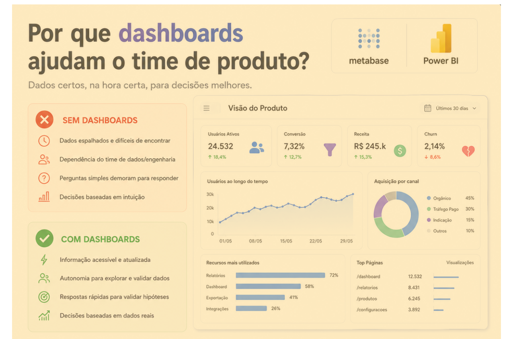

# Dashboards: transformando dados em decisões melhores

> 🟢 **Iniciante** • ⏱️ **6 min de leitura**
>
> **Tecnologias:** Metabase • Power BI • Analytics • Produto

!!! info "Neste artigo você verá"

    Ao final deste artigo você será capaz de:

    - Entender por que dashboards vão além de gráficos.
    - Descobrir como métricas ajudam na tomada de decisão.
    - Identificar boas práticas para construir dashboards úteis.
    - Compreender como equipes Data Driven trabalham.

---

## O problema

Toda equipe toma decisões.

A diferença está na forma como essas decisões são tomadas.

Quando métricas importantes ficam espalhadas entre planilhas, consultas SQL ou dependem de alguém para serem geradas, o processo fica lento e sujeito a interpretações diferentes.

Sem acesso rápido às informações, priorizações acabam sendo baseadas em percepções ou experiências individuais.

---

## Por que isso importa?

Quanto mais fácil for acessar indicadores confiáveis, mais rápido a equipe consegue validar hipóteses, identificar problemas e acompanhar a evolução do produto.

Dashboards reduzem o tempo gasto procurando informações e aumentam a qualidade das decisões.

Em vez de perguntar **"o que está acontecendo?"**, o time passa a discutir **"o que devemos fazer agora?"**.

---

## O que é um dashboard?

Um dashboard é uma interface que reúne indicadores importantes de forma visual e atualizada.

Seu objetivo não é apenas apresentar gráficos, mas facilitar a interpretação dos dados para apoiar decisões.

Ferramentas como **Metabase** e **Power BI** permitem consolidar informações de diferentes fontes em um único lugar, tornando métricas acessíveis para áreas como Produto, Engenharia, Comercial e Liderança.

---

## O que um bom dashboard deve responder?

Antes de criar qualquer gráfico, vale responder uma pergunta simples:

**Qual decisão esse dashboard ajudará a tomar?**

Um dashboard eficiente normalmente responde questões como:

- Como estão os principais KPIs do produto?
- Houve crescimento ou queda em alguma métrica?
- Existe alguma tendência preocupante?
- Qual funcionalidade gera maior impacto?
- Onde devemos priorizar nossos esforços?

Quando os dados respondem perguntas reais do negócio, eles se tornam muito mais úteis.

---

## Benefícios

Dashboards bem construídos ajudam equipes a:

- acompanhar KPIs em tempo real;
- validar hipóteses com dados;
- identificar tendências rapidamente;
- priorizar funcionalidades com mais confiança;
- compartilhar informações entre diferentes áreas;
- reduzir decisões baseadas em achismo.

Mais do que mostrar números, eles tornam a informação acessível para quem precisa decidir.

---

## Quando utilizar

Dashboards são especialmente úteis quando existe necessidade de acompanhar indicadores continuamente.

Alguns exemplos:

- evolução de receita;
- crescimento da base de usuários;
- taxas de conversão;
- indicadores operacionais;
- métricas de produto;
- disponibilidade de serviços.

Quanto mais frequente a necessidade de consultar essas informações, maior o valor de um dashboard.

---

## Quando evitar

Nem todo conjunto de dados precisa virar um painel.

Dashboards com dezenas de gráficos, métricas pouco relevantes ou informações desatualizadas acabam dificultando a interpretação.

Um bom dashboard é simples, objetivo e construído para responder perguntas específicas.

---

## Boas práticas

Algumas recomendações ajudam bastante:

- definir claramente quais KPIs serão acompanhados;
- evitar excesso de gráficos na mesma tela;
- manter nomenclaturas consistentes;
- destacar indicadores realmente importantes;
- revisar periodicamente métricas que deixaram de gerar valor.

O foco deve ser facilitar decisões, e não impressionar pela quantidade de informações.

---

## Na prática

Imagine que um Product Manager precise decidir qual funcionalidade deve entrar na próxima sprint.

Sem dados, essa decisão pode ser baseada apenas em opiniões.

Com dashboards atualizados, é possível analisar métricas como uso da funcionalidade, taxa de conversão, volume de chamados ou impacto na receita.

A decisão continua sendo humana, mas passa a ser muito melhor fundamentada.

---

## Conclusão

Dashboards não servem apenas para mostrar gráficos.

Eles transformam dados em informações que ajudam equipes a tomar decisões com mais rapidez e segurança.

Ferramentas como Metabase e Power BI permitem que Produto, Engenharia e Negócio compartilhem a mesma visão sobre o produto, reduzindo incertezas e fortalecendo uma cultura orientada por dados.

No fim, o maior valor de um dashboard não está nas visualizações.

Está na qualidade das decisões que ele ajuda a tomar.

---

## Continue aprendendo

Se este assunto foi útil para você, recomendo também:

- Apache Airflow
- Pandas e BeautifulSoup no processo de ETL
- Como desenvolvedores podem contribuir nos refinamentos com Produto
- Jira e Confluence: vale mesmo a pena usar essas ferramentas?

---

## Referências

- Metabase Documentation
- Microsoft Power BI Documentation
- Lean Analytics — Alistair Croll e Benjamin Yoskovitz
- Inspired — Marty Cagan