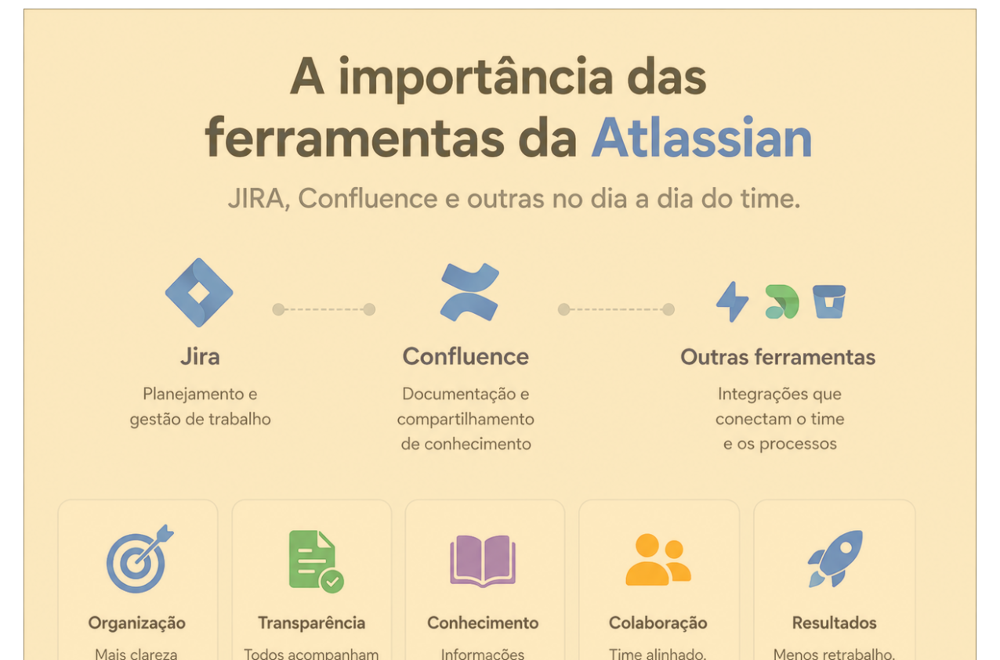

# Jira e Confluence: vale mesmo a pena usar essas ferramentas?

> 🟢 **Iniciante** • ⏱️ **6 min de leitura**
>
> **Tecnologias:** Jira • Confluence • Agile • Engenharia de Software

!!! info "Neste artigo você verá"

    Ao final deste artigo você será capaz de:

    - Entender o papel do Jira e do Confluence em equipes de desenvolvimento.
    - Identificar os principais benefícios dessas ferramentas.
    - Compreender por que processos bem definidos são mais importantes que a ferramenta em si.
    - Descobrir boas práticas para aproveitar melhor o ecossistema Atlassian.

---

## O problema

É comum encontrar equipes que enxergam Jira e Confluence apenas como mais uma obrigação do dia a dia.

Atualizar cards, escrever documentação ou registrar decisões pode parecer burocrático quando o foco está em desenvolver software.

Mas essa percepção normalmente muda conforme o projeto cresce.

Sem uma organização mínima, informações importantes ficam espalhadas em mensagens, reuniões e conversas particulares, dificultando a continuidade do trabalho.

---

## Por que isso importa?

Projetos de software evoluem continuamente.

Novos integrantes entram no time, requisitos mudam, decisões são revisadas e funcionalidades passam por diversas versões.

Quando essas informações não ficam registradas em um local acessível, o conhecimento acaba dependendo da memória das pessoas.

Isso aumenta o retrabalho, gera interpretações diferentes e dificulta a colaboração entre as equipes.

---

## O papel do Jira

O Jira vai muito além de um quadro de tarefas.

Quando utilizado corretamente, ele ajuda o time a:

- organizar prioridades;
- acompanhar o andamento das entregas;
- registrar critérios de aceite;
- visualizar dependências;
- manter histórico das demandas.

Mais do que controlar tarefas, ele fornece transparência sobre o trabalho que está sendo realizado.

---

## O papel do Confluence

Enquanto o Jira organiza o trabalho, o Confluence organiza o conhecimento.

Ele é um espaço para registrar:

- documentação funcional;
- documentação técnica;
- decisões arquiteturais;
- processos internos;
- materiais de onboarding;
- atas de reuniões.

Uma boa documentação reduz dúvidas e evita que informações importantes fiquem perdidas em conversas de chat.

---

## Benefícios

Quando Jira e Confluence são utilizados em conjunto, diversos ganhos aparecem naturalmente:

- maior alinhamento entre Produto e Engenharia;
- documentação centralizada;
- redução de retrabalho;
- histórico de decisões;
- onboarding mais rápido;
- comunicação mais eficiente.

O benefício não está apenas na organização.

Está em permitir que qualquer integrante encontre rapidamente as informações necessárias para continuar o trabalho.

---

## Quando utilizar

Ferramentas como Jira e Confluence são especialmente úteis em equipes que:

- possuem vários desenvolvedores;
- trabalham com metodologias ágeis;
- mantêm produtos em constante evolução;
- precisam registrar decisões importantes;
- valorizam compartilhamento de conhecimento.

Quanto maior o projeto, maior costuma ser o retorno obtido com uma boa organização.

---

## Quando evitar

O erro mais comum é transformar essas ferramentas em um fim, e não em um meio.

Criar documentação excessiva, atualizar tarefas sem propósito ou registrar informações que nunca serão consultadas gera burocracia e reduz o engajamento da equipe.

O objetivo deve ser facilitar o trabalho, e não criar processos desnecessários.

---

## Boas práticas

Algumas práticas tornam o uso dessas ferramentas muito mais eficiente:

- manter os cards sempre atualizados;
- escrever descrições objetivas e completas;
- registrar decisões importantes no Confluence;
- vincular documentação aos cards do Jira;
- revisar conteúdos antigos periodicamente;
- manter uma estrutura simples e fácil de navegar.

---

## Na prática

Imagine que um novo desenvolvedor entre no time.

Se as funcionalidades possuem documentação, decisões arquiteturais estão registradas e os cards do Jira contêm contexto suficiente, o tempo necessário para entender o projeto é significativamente menor.

Agora imagine o cenário oposto: informações espalhadas em mensagens, reuniões e memória das pessoas.

Boa parte do conhecimento precisará ser reconstruída, consumindo tempo tanto do novo integrante quanto dos demais membros da equipe.

---

## Conclusão

Ferramentas como Jira e Confluence não substituem processos bem definidos.

Elas potencializam equipes que valorizam organização, compartilhamento de conhecimento e colaboração.

Quando utilizadas de forma equilibrada, ajudam a reduzir retrabalho, preservar contexto e tornar o desenvolvimento mais previsível.

No fim, o maior benefício não está na ferramenta.

Está na cultura construída em torno dela.

---

## Continue aprendendo

Se este assunto foi útil para você, recomendo também:

- A importância da documentação para humanos e IA
- Spec-Driven Development
- Slack: boas práticas para uma comunicação mais eficiente

---

## Referências

- Atlassian — Jira Software Documentation
- Atlassian — Confluence Documentation
- Team Topologies — Matthew Skelton e Manuel Pais