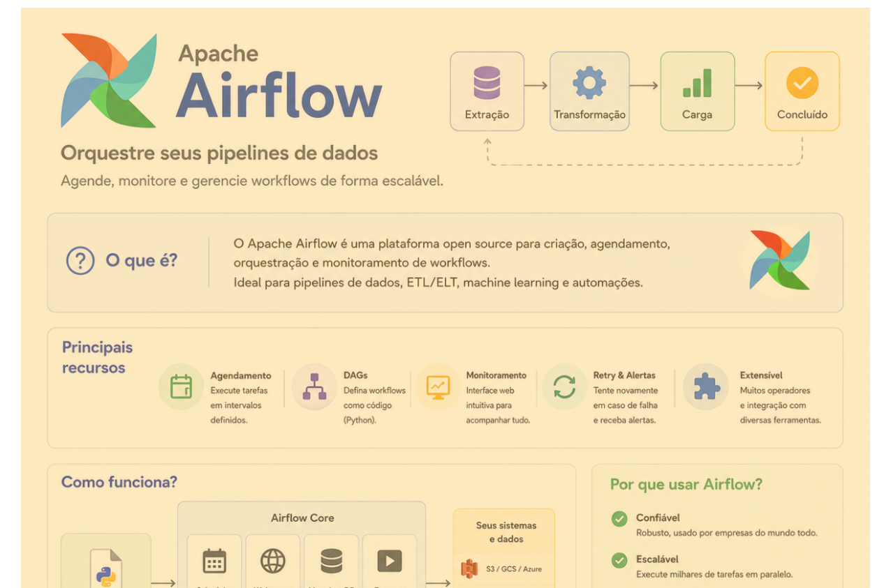

# Apache Airflow: muito além de um agendador de tarefas

> 🟡 **Intermediário** • ⏱️ **7 min de leitura**
>
> **Tecnologias:** Python • Apache Airflow • ETL • Engenharia de Dados



!!! info "Neste artigo você verá"

    Ao final deste artigo você será capaz de:

    - Entender o papel do Apache Airflow em pipelines de dados.
    - Compreender o conceito de DAG (Directed Acyclic Graph).
    - Saber quando utilizar o Airflow em vez de um simples agendador de tarefas.
    - Conhecer boas práticas para construir workflows confiáveis.

---

## O problema

Automatizar uma única tarefa costuma ser simples.

O desafio aparece quando um processo depende de várias etapas executadas em uma ordem específica.

Imagine um pipeline que precisa:

- extrair dados de uma API;
- transformar essas informações;
- validar os resultados;
- armazenar tudo em um Data Warehouse;
- gerar relatórios ao final da execução.

Controlar esse fluxo manualmente ou utilizando scripts independentes rapidamente se torna difícil de manter.

---

## Por que isso importa?

Em pipelines de dados, uma única falha pode comprometer todo o processo.

Sem uma ferramenta de orquestração, torna-se complicado identificar onde ocorreu o erro, repetir apenas a etapa necessária ou acompanhar a execução do pipeline.

O Apache Airflow resolve justamente esse problema ao coordenar todas as etapas do fluxo de maneira organizada e observável.

---

## O que é o Apache Airflow?

O Apache Airflow é uma plataforma de orquestração de workflows.

Em vez de apenas executar tarefas, ele coordena **quando**, **como** e **em que ordem** cada etapa deve acontecer.

Seu principal conceito é a **DAG (Directed Acyclic Graph)**, que representa um fluxo de execução composto por tarefas e dependências.

Cada tarefa só será executada quando todas as etapas anteriores forem concluídas com sucesso.

---

## Como funciona?

Um workflow é definido como código em Python.

Cada etapa representa uma tarefa e as dependências definem a ordem de execução.

Um fluxo simples pode ser representado da seguinte forma:

```text
Extrair Dados
      │
      ▼
Transformar Dados
      │
      ▼
Validar Dados
      │
      ▼
Carregar Data Warehouse
      │
      ▼
Gerar Relatório
```

Essa estrutura facilita tanto a manutenção quanto o monitoramento do pipeline.

---

## Principais recursos

O Apache Airflow oferece diversas funcionalidades que simplificam a execução de workflows:

- definição de pipelines utilizando Python;
- agendamento automático de execuções;
- monitoramento visual de cada tarefa;
- retries automáticos em caso de falhas;
- controle de dependências entre etapas;
- integração com bancos de dados, APIs e serviços em nuvem.

Esses recursos tornam a ferramenta adequada para pipelines complexos e processos recorrentes.

---

## Quando utilizar

O Airflow é especialmente indicado para:

- pipelines de ETL e ELT;
- cargas periódicas de dados;
- automação de processos corporativos;
- integração entre múltiplos sistemas;
- workflows compostos por diversas etapas dependentes.

Quanto maior o pipeline, maior tende a ser o benefício da orquestração.

---

## Quando evitar

Nem toda automação precisa de um orquestrador.

Se o processo consiste em apenas uma tarefa simples executada diariamente, soluções como um cron ou um scheduler da própria aplicação costumam ser suficientes.

O Airflow mostra seu verdadeiro valor quando existem dependências entre tarefas, necessidade de monitoramento e recuperação automática após falhas.

---

## Boas práticas

Algumas recomendações ajudam a manter pipelines mais confiáveis:

- desenvolver tarefas pequenas e independentes;
- tornar as tarefas idempotentes sempre que possível;
- configurar políticas de retry para falhas transitórias;
- monitorar tempos de execução e gargalos;
- registrar logs detalhados para facilitar investigações.

Essas práticas tornam os workflows mais resilientes e fáceis de manter.

---

## Na prática

Imagine um pipeline responsável por importar diariamente milhões de registros de diferentes sistemas.

Caso uma etapa falhe durante a transformação dos dados, não é necessário reiniciar todo o processo.

O Airflow identifica exatamente onde ocorreu o problema e permite reexecutar apenas a tarefa afetada, preservando as etapas que já foram concluídas com sucesso.

Essa capacidade reduz tempo de recuperação e aumenta significativamente a confiabilidade dos pipelines.

---

## Conclusão

O Apache Airflow não substitui suas aplicações.

Ele atua como um orquestrador, coordenando workflows compostos por múltiplas tarefas, dependências e integrações.

Por isso, tornou-se uma das ferramentas mais utilizadas em Engenharia de Dados, ETL, ELT e automações de larga escala.

Quando bem utilizado, ele transforma processos complexos em fluxos organizados, monitoráveis e muito mais fáceis de manter.

---

## Continue aprendendo

Se este assunto foi útil para você, recomendo também:

- Pandas e BeautifulSoup no processo de ETL
- Amazon SQS
- Event-Driven Architecture
- Observabilidade: Logs, Métricas e Traces

---

## Referências

- Apache Airflow Documentation
- Apache Airflow Best Practices
- Designing Data-Intensive Applications — Martin Kleppmann