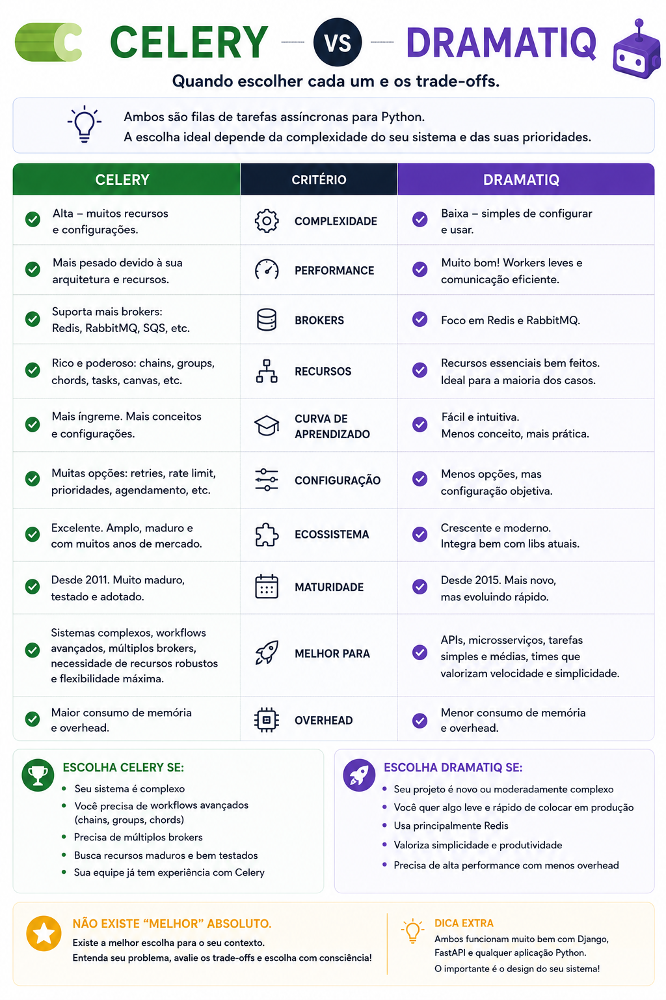

# Celery vs Dramatiq: qual escolher?

> 🟡 **Intermediário** • ⏱️ **7 min de leitura**
>
> **Tecnologias:** Python • Celery • Dramatiq

!!! info "Neste artigo você verá"

    Ao final deste artigo você será capaz de:

    - Entender o papel de Celery e Dramatiq.
    - Conhecer as principais diferenças entre as duas bibliotecas.
    - Descobrir quando cada uma faz mais sentido.
    - Escolher a ferramenta mais adequada para seu projeto.

---

## O problema

Aplicações modernas frequentemente precisam executar tarefas em segundo plano.

Alguns exemplos:

- envio de e-mails;
- geração de relatórios;
- processamento de imagens;
- importação de dados;
- integrações com APIs externas.

Executar essas operações durante a requisição pode aumentar a latência e prejudicar a experiência do usuário.

Bibliotecas como Celery e Dramatiq resolvem esse problema permitindo que essas tarefas sejam processadas de forma assíncrona.

---

## Por que isso importa?

Mover tarefas demoradas para segundo plano torna a aplicação mais responsiva e facilita a escalabilidade.

O desafio está em escolher a ferramenta mais adequada para o contexto do projeto.

Celery e Dramatiq possuem objetivos semelhantes, mas fazem escolhas diferentes em relação à simplicidade, flexibilidade e recursos disponíveis.

---

## O que é o Celery?

O Celery é uma das bibliotecas mais tradicionais do ecossistema Python para processamento assíncrono.

Seu ecossistema amadureceu ao longo de muitos anos e oferece suporte a diversos brokers, schedulers e funcionalidades avançadas.

Ele é amplamente utilizado em aplicações Django e em sistemas de grande porte.

---

## O que é o Dramatiq?

O Dramatiq surgiu com a proposta de simplificar o desenvolvimento de tarefas assíncronas.

Sua API é enxuta, a configuração costuma ser menor e a curva de aprendizado é bastante amigável.

Para muitos projetos, ele oferece tudo o que é necessário com menos complexidade operacional.

---

## Comparando as duas abordagens

| Característica | Celery | Dramatiq |
|----------------|--------|----------|
| Curva de aprendizado | Maior | Menor |
| Configuração | Mais extensa | Mais simples |
| Ecossistema | Muito maduro | Menor, mas em crescimento |
| Recursos avançados | Excelente | Bom |
| Facilidade para começar | Boa | Excelente |

Nenhuma dessas características torna uma ferramenta automaticamente melhor que a outra.

Tudo depende das necessidades do projeto.

---

## Quando escolher Celery?

O Celery costuma ser uma excelente opção quando:

- o projeto já utiliza Celery;
- existe necessidade de workflows mais complexos;
- recursos avançados são importantes;
- há integração com um ecossistema consolidado;
- a equipe já possui experiência com a ferramenta.

Sua maturidade faz dele uma escolha bastante segura para aplicações grandes.

---

## Quando escolher Dramatiq?

O Dramatiq costuma fazer sentido quando:

- a prioridade é simplicidade;
- o projeto está começando;
- as tarefas assíncronas não possuem grande complexidade;
- a equipe deseja menor esforço de configuração;
- produtividade inicial é um fator importante.

Para muitos cenários, ele entrega uma excelente experiência de desenvolvimento.

---

## Benefícios em comum

Independentemente da biblioteca escolhida, ambas permitem:

- processamento assíncrono;
- workers independentes;
- retries automáticos;
- integração com brokers de mensagens;
- maior responsividade da aplicação.

A principal diferença está na experiência de uso e nos recursos oferecidos.

---

## Boas práticas

Algumas recomendações valem para qualquer solução de processamento assíncrono:

- criar tarefas pequenas e independentes;
- tornar operações idempotentes;
- monitorar filas e workers;
- registrar logs detalhados;
- definir políticas de retry adequadas.

Essas práticas tornam o processamento mais confiável independentemente da ferramenta escolhida.

---

## Na prática

Imagine uma aplicação responsável por enviar milhares de e-mails diariamente.

Se o projeto já possui uma infraestrutura consolidada e diversos workflows assíncronos, o Celery provavelmente oferece mais flexibilidade para lidar com esse cenário.

Agora imagine uma API recém-criada que precisa apenas enviar e-mails, gerar alguns relatórios e executar poucas tarefas em segundo plano.

Nesse caso, o Dramatiq pode proporcionar uma implementação mais simples, reduzindo configuração e acelerando o desenvolvimento.

Em ambos os casos, o objetivo continua sendo o mesmo: retirar tarefas demoradas do fluxo principal da aplicação.

---

## Conclusão

Celery e Dramatiq resolvem o mesmo tipo de problema, mas fazem escolhas diferentes.

O Celery oferece um ecossistema extremamente maduro e recursos avançados.

O Dramatiq aposta em simplicidade, produtividade e uma experiência de desenvolvimento mais enxuta.

Não existe uma ferramenta universalmente melhor.

Existe a ferramenta que melhor atende às necessidades do seu projeto e da sua equipe.

---

## Continue aprendendo

Se este assunto foi útil para você, recomendo também:

- Apache Airflow
- Amazon SQS
- Redis: muito além do cache
- Event-Driven Architecture

---

## Referências

- Celery Documentation
- Dramatiq Documentation
- Architecture Patterns with Python — Harry Percival e Bob Gregory