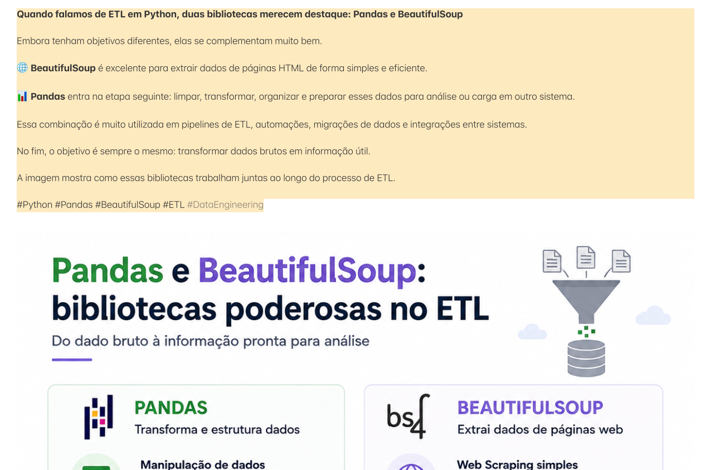

# Pandas e BeautifulSoup: duas bibliotecas essenciais para ETL em Python

> 🟡 **Intermediário** • ⏱️ **7 min de leitura**
>
> **Tecnologias:** Python • Pandas • BeautifulSoup • ETL



!!! info "Neste artigo você verá"

    Ao final deste artigo você será capaz de:

    - Entender o papel do Pandas e do BeautifulSoup em um pipeline de ETL.
    - Saber quando utilizar cada biblioteca.
    - Compreender como elas se complementam.
    - Conhecer boas práticas para processamento de dados em Python.

---

## O problema

Em muitos projetos, os dados necessários para gerar relatórios, integrar sistemas ou alimentar um Data Warehouse não estão disponíveis em um formato pronto para uso.

Eles podem estar em páginas HTML, APIs, arquivos CSV, planilhas ou diversas outras fontes.

Antes que esses dados gerem valor para o negócio, normalmente precisam passar por um processo de extração, limpeza, transformação e organização.

É justamente nesse cenário que bibliotecas como **BeautifulSoup** e **Pandas** se destacam.

---

## Por que isso importa?

Dados brutos raramente estão prontos para análise.

Valores inconsistentes, campos vazios, formatos diferentes e informações distribuídas em múltiplas fontes fazem parte da rotina de quem trabalha com Engenharia de Dados.

Utilizar ferramentas adequadas reduz a complexidade desse processo e torna os pipelines mais simples de manter.

---

## O que é ETL?

ETL significa:

- **Extract (Extração):** obter os dados de uma ou mais fontes.
- **Transform (Transformação):** limpar, validar e organizar as informações.
- **Load (Carga):** armazenar os dados em outro sistema, banco de dados ou Data Warehouse.

Cada etapa possui desafios específicos e diferentes ferramentas podem ser utilizadas ao longo desse fluxo.

---

## O papel do BeautifulSoup

O BeautifulSoup é uma biblioteca especializada na extração de informações contidas em documentos HTML e XML.

Ele permite navegar pela estrutura da página, localizar elementos específicos e recuperar apenas os dados desejados.

Um exemplo simples:

```python
from bs4 import BeautifulSoup

html = "<h1>Artigo</h1>"

soup = BeautifulSoup(html, "html.parser")

print(soup.h1.text)
```

Resultado:

```text
Artigo
```

Essa abordagem é muito utilizada em processos de Web Scraping e integrações com sistemas que disponibilizam informações por meio de páginas HTML.

---

## O papel do Pandas

Depois que os dados foram obtidos, entra em cena o Pandas.

Sua principal função é transformar dados brutos em estruturas organizadas e prontas para análise.

Algumas tarefas bastante comuns incluem:

- remover registros duplicados;
- tratar valores ausentes;
- converter tipos de dados;
- agrupar informações;
- gerar estatísticas;
- exportar para CSV, Excel ou banco de dados.

Exemplo:

```python
import pandas as pd

df = pd.read_csv("clientes.csv")

df = df.drop_duplicates()

df["idade"] = df["idade"].fillna(0)
```

Em poucas linhas é possível realizar transformações que manualmente consumiriam muito mais tempo.

---

## Como elas trabalham juntas?

Um pipeline simples pode seguir este fluxo:

```text
Página HTML
      │
      ▼
BeautifulSoup
(Extração)
      │
      ▼
Pandas
(Limpeza e Transformação)
      │
      ▼
Banco de Dados
Data Warehouse
Dashboard
```

Cada biblioteca atua em uma etapa diferente do processo, tornando a solução mais organizada e fácil de manter.

---

## Quando utilizar

Essa combinação é especialmente útil em cenários como:

- Web Scraping;
- migração de dados;
- automações;
- integrações entre sistemas;
- geração de relatórios;
- construção de pipelines de ETL.

Sempre que houver necessidade de transformar dados brutos em informações estruturadas, Pandas e BeautifulSoup podem trabalhar em conjunto.

---

## Quando evitar

Nem todo projeto exige essas bibliotecas.

Se os dados já são disponibilizados por APIs estruturadas em JSON, por exemplo, o BeautifulSoup normalmente não será necessário.

Da mesma forma, para pequenas manipulações de dados, utilizar Pandas pode representar uma complexidade desnecessária.

A escolha da ferramenta deve considerar o problema que precisa ser resolvido.

---

## Boas práticas

Algumas recomendações ajudam a construir pipelines mais confiáveis:

- separar claramente as etapas de extração e transformação;
- validar os dados antes de carregá-los;
- evitar misturar regras de negócio com código de extração;
- tratar exceções durante a coleta de dados;
- registrar logs para facilitar investigações.

Essas práticas tornam os processos mais robustos e fáceis de evoluir.

---

## Na prática

Imagine uma empresa que precisa atualizar diariamente informações de produtos publicadas em um portal externo.

O BeautifulSoup é utilizado para extrair os dados das páginas HTML.

Em seguida, o Pandas organiza, valida e transforma essas informações antes de carregá-las em um banco de dados utilizado pelo time de Produto.

Todo esse processo pode ser executado automaticamente, reduzindo trabalho manual e aumentando a confiabilidade dos dados.

---

## Conclusão

Pandas e BeautifulSoup possuem objetivos diferentes, mas se complementam muito bem.

Enquanto o BeautifulSoup é responsável por extrair informações de documentos HTML, o Pandas organiza, transforma e prepara esses dados para análise ou armazenamento.

Juntas, essas bibliotecas formam uma combinação poderosa para pipelines de ETL, automações e integrações entre sistemas.

---

## Continue aprendendo

Se este assunto foi útil para você, recomendo também:

- Apache Airflow
- Dashboards para tomada de decisão
- Amazon SQS
- Event-Driven Architecture

---

## Referências

- Pandas Documentation
- BeautifulSoup Documentation
- Python Data Science Handbook — Jake VanderPlas
- Designing Data-Intensive Applications — Martin Kleppmann