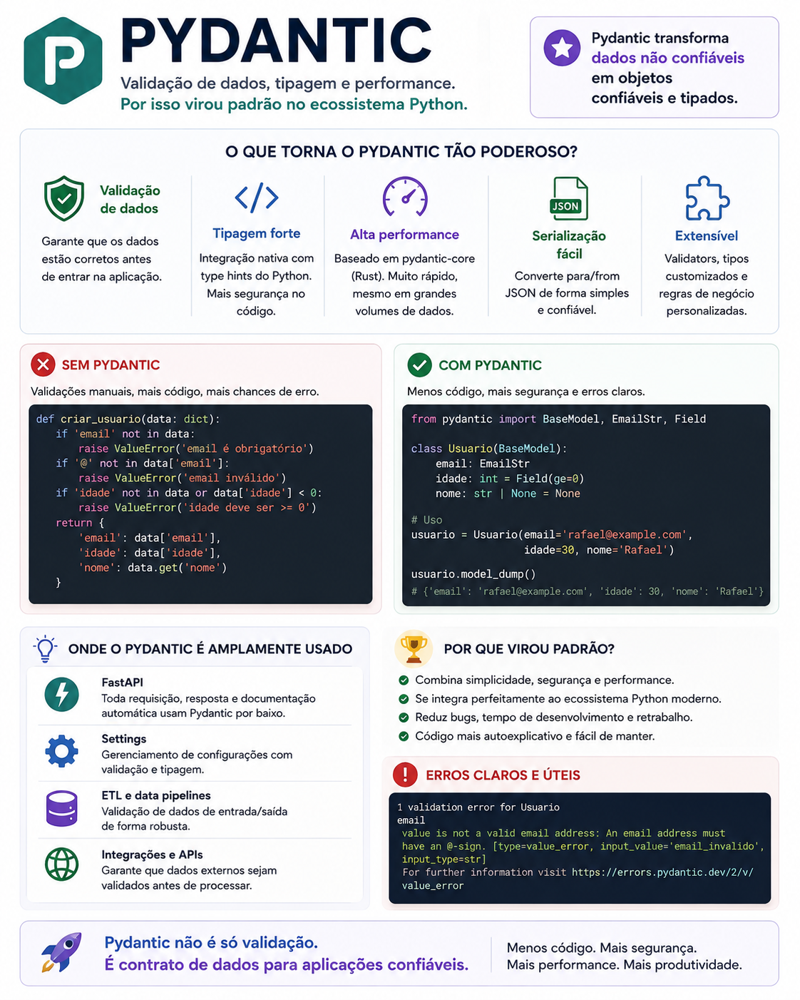

# Pydantic: validação de dados do jeito Python

> 🟡 **Intermediário** • ⏱️ **7 min de leitura**
>
> **Tecnologias:** Python • Pydantic • FastAPI



!!! info "Neste artigo você verá"

    Ao final deste artigo você será capaz de:

    - Entender o papel do Pydantic em aplicações Python.
    - Descobrir por que ele se tornou um padrão do ecossistema.
    - Conhecer seus principais benefícios.
    - Saber quando utilizar modelos Pydantic.

---

## O problema

Toda aplicação recebe dados de fontes externas.

Eles podem vir de:

- APIs;
- formulários;
- filas;
- arquivos;
- bancos de dados;
- integrações entre sistemas.

O problema é que esses dados nem sempre possuem o formato esperado.

Durante muito tempo, validar essas informações significava escrever diversos `if`, verificar tipos manualmente e tratar inúmeros casos de erro espalhados pela aplicação.

Além de repetitivo, esse código era difícil de manter.

---

## Por que isso importa?

Quanto mais cedo um dado inválido é identificado, menor tende a ser o impacto no restante da aplicação.

Em vez de permitir que informações incorretas avancem pelo sistema, é melhor validá-las logo na entrada.

Isso reduz bugs, melhora as mensagens de erro e torna o código muito mais previsível.

---

## O que é o Pydantic?

O Pydantic é uma biblioteca para modelagem e validação de dados baseada em **type hints** do Python.

Em vez de escrever validações manualmente, basta definir um modelo.

Exemplo:

```python
from pydantic import BaseModel

class Usuario(BaseModel):
    nome: str
    idade: int
```

Quando um objeto é criado, o Pydantic valida automaticamente os dados recebidos.

Caso alguma informação seja inválida, uma exceção detalhada é gerada.

---

## Principais benefícios

O Pydantic oferece diversas vantagens para aplicações modernas.

### Validação automática

Os dados são verificados antes mesmo de serem utilizados pela aplicação.

Isso reduz significativamente a necessidade de validações repetitivas.

---

### Tipagem forte

Os modelos utilizam os próprios tipos do Python.

Isso melhora a legibilidade e facilita o trabalho de IDEs, linters e ferramentas de análise estática.

---

### Mensagens de erro claras

Quando ocorre uma validação inválida, o Pydantic informa exatamente:

- qual campo apresentou problema;
- qual valor foi recebido;
- qual tipo era esperado.

Isso facilita bastante o diagnóstico de erros.

---

### Conversão de tipos

Além de validar, o Pydantic também converte automaticamente diversos tipos compatíveis.

Exemplo:

```python
Usuario(
    nome="Rafael",
    idade="30"
)
```

Mesmo recebendo `"30"` como string, o objeto será criado com `idade` como inteiro.

---

### Integração com FastAPI

Grande parte da popularidade do Pydantic veio da integração com o FastAPI.

Os modelos são utilizados para:

- validar requisições;
- validar respostas;
- gerar documentação OpenAPI automaticamente.

Essa integração reduz bastante a quantidade de código necessária para criar APIs.

---

## Quando utilizar

O Pydantic é especialmente útil em:

- APIs REST;
- microsserviços;
- processamento de mensagens;
- integrações entre sistemas;
- leitura de arquivos JSON;
- validação de configurações.

Sempre que dados externos entrarem na aplicação, ele pode ajudar a garantir consistência.

---

## Quando evitar

Nem toda estrutura de dados precisa ser um modelo Pydantic.

Objetos utilizados apenas internamente ou que não recebem dados externos podem não se beneficiar dessa camada de validação.

Além disso, em aplicações extremamente sensíveis a desempenho, é importante avaliar o custo da validação em relação ao volume de dados processados.

---

## Boas práticas

Algumas recomendações ajudam bastante:

- criar modelos específicos para entrada e saída;
- evitar reutilizar o mesmo modelo para diferentes responsabilidades;
- aproveitar type hints do Python;
- utilizar validações customizadas apenas quando necessário;
- manter os modelos simples e focados em representar os dados.

---

## Na prática

Imagine uma API que recebe informações para criar um novo usuário.

Sem validação, campos obrigatórios podem estar ausentes, tipos podem ser incorretos e valores inválidos acabam sendo descobertos apenas em partes mais profundas da aplicação.

Com um modelo Pydantic, essas verificações acontecem imediatamente.

Se algum dado estiver incorreto, a requisição é rejeitada com uma mensagem clara antes que qualquer regra de negócio seja executada.

Isso torna a aplicação mais segura e muito mais previsível.

---

## Conclusão

O Pydantic mudou a forma como aplicações Python tratam dados de entrada.

Ao combinar tipagem, validação automática e mensagens de erro claras, ele elimina grande parte do código repetitivo que antes era necessário para garantir a consistência das informações.

Não por acaso, tornou-se uma das bibliotecas mais importantes do ecossistema Python moderno e um componente fundamental de frameworks como o FastAPI.

Mais do que validar dados, o Pydantic ajuda a transformar informações externas em objetos confiáveis.

---

## Continue aprendendo

Se este assunto foi útil para você, recomendo também:

- Django Constraints
- Idempotência
- Celery vs Dramatiq
- Apache Airflow

---

## Referências

- Pydantic Documentation
- FastAPI Documentation
- Python Enhancement Proposal 484 (Type Hints)